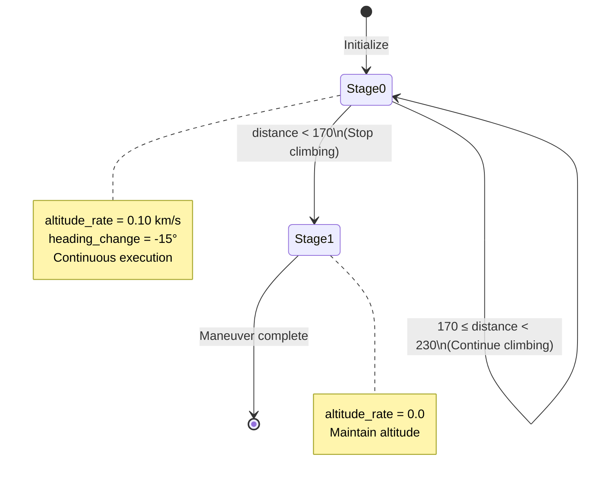

# Design Document: V03 Altitude Control Fix

## Overview

This design addresses a critical bug in the V03 scenario (POPUP_TURN maneuver) where enemy aircraft fail to climb as expected during the low-altitude penetration and pop-up maneuver. The root cause has been identified through extensive diagnosis (V4, V5, V6 iterations): the altitude control logic immediately transitions to stage 1 after setting the climb rate, causing the altitude_rate command to stop executing after only one integration step.

### Problem Summary

The current implementation in `scenario_generator.py` (lines 415-445) has the following flawed logic:

```python
elif self.maneuver == ManeuverType.POPUP_TURN:
    if distance < 230 and self._popup_stage == 0:
        for i in range(4):
            commands[i] = {
                'heading_change': -15,
                'altitude_rate': 0.10,  # Fast climb
            }
        self._popup_stage = 1  # ❌ Immediately switches to stage 1
    
    elif distance < 170 and self._popup_stage == 1:
        for i in range(4):
            commands[i] = {'altitude_rate': 0.0}  # Stop climbing
        self._popup_stage = 2
```

**The Issue:**
1. At distance=230km, the code sets `altitude_rate=0.10` and immediately sets `self._popup_stage = 1`
2. On the next step (distance=225km), the condition `distance < 230 and self._popup_stage == 0` is FALSE (stage is now 1)
3. The condition `distance < 170 and self._popup_stage == 1` is also FALSE (distance still > 170)
4. Result: No commands are issued, altitude_rate stops executing
5. The altitude only increases by 66ft (one integration step) instead of the required 5.5km

### Expected Behavior

- Enemy aircraft should climb from 3.5km (11483ft) to 9km (29528ft), a delta of 5.5km (18045ft)
- Climb rate: 0.10 km/s = 328 ft/s
- Duration: ~55 seconds
- Distance change: 230km - 170km = 60km
- At speed 0.381 km/s, this takes ~157 seconds (sufficient time for the climb)

### Solution Approach

The fix changes the stage 0 condition from `distance < 230` to `170 <= distance < 230`, ensuring that altitude_rate commands continue to be issued throughout the entire climb range. The stage transition to 1 only occurs when `distance < 170`, after the climb is complete.

## Architecture

### Component Structure

The fix involves a single component:

```
scenario_generator.py
└── EnemyScenario.get_maneuver_commands()
    └── POPUP_TURN maneuver logic
        ├── Stage 0: Continuous climb (170km ≤ distance < 230km)
        └── Stage 1: Stop climbing (distance < 170km)
```

### Data Flow

```
Simulation Loop
    ↓
get_maneuver_commands(distance, time)
    ↓
Check distance range
    ↓
If 170 ≤ distance < 230:
    - Set altitude_rate = 0.10 km/s
    - Set heading_change = -15°
    - Keep _popup_stage = 0
    ↓
If distance < 170:
    - Set altitude_rate = 0.0
    - Transition _popup_stage to 1
    ↓
Return commands to simulation
    ↓
Apply altitude_rate to aircraft
```

### State Machine



## Components and Interfaces

### Modified Component: EnemyScenario.get_maneuver_commands()

**Location:** `scripts/tacticalProject/cap/tests/scenario_generator.py` (lines 415-445)

**Interface:**
```python
def get_maneuver_commands(self, distance: float, time: float) -> List[Dict]:
    """
    Generate maneuver commands based on current distance and time.
    
    Args:
        distance: Current distance to friendly forces (km)
        time: Simulation time (seconds)
    
    Returns:
        List of 4 command dictionaries, one per aircraft
        Each dict may contain:
        - 'heading_change': float (degrees)
        - 'altitude_rate': float (km/s)
    """
```

**Modified Logic for POPUP_TURN:**

```python
elif self.maneuver == ManeuverType.POPUP_TURN:
    if not hasattr(self, '_popup_stage'):
        self._popup_stage = 0
    
    # Stage 0: Continuous climb from 230km to 170km
    if 170 <= distance < 230 and self._popup_stage == 0:
        for i in range(4):
            commands[i] = {
                'heading_change': -15,      # Left turn 15 degrees
                'altitude_rate': 0.10,      # Fast climb 0.10 km/s
            }
    
    # Stage 1: Stop climbing at 170km
    elif distance < 170 and self._popup_stage == 0:
        for i in range(4):
            commands[i] = {'altitude_rate': 0.0}  # Stop climbing
        self._popup_stage = 1  # Mark completion
```

**Key Changes:**
1. Changed condition from `distance < 230` to `170 <= distance < 230`
2. Moved stage transition to the second condition block
3. Stage transition only occurs when `distance < 170`
4. Ensures continuous command execution throughout the climb range

### Integration Points

**Upstream:** Simulation loop calls `get_maneuver_commands()` on every step
**Downstream:** Commands are applied by `apply_enemy_maneuver()` in the simulation

**No interface changes required** - the method signature and return type remain identical.

## Data Models

### Command Dictionary Structure

```python
{
    'heading_change': float,    # Optional: degrees to change heading
    'altitude_rate': float,     # Optional: km/s rate of altitude change
}
```

### State Variables

```python
self._popup_stage: int
    # 0: Climbing phase (170km ≤ distance < 230km)
    # 1: Climb complete (distance < 170km)
```

### Distance Ranges

```python
CLIMB_START_DISTANCE = 230  # km - Start climbing
CLIMB_END_DISTANCE = 170    # km - Stop climbing
CLIMB_RATE = 0.10           # km/s - Fast climb rate
TURN_ANGLE = -15            # degrees - Left turn
```

## Correctness Properties

*A property is a characteristic or behavior that should hold true across all valid executions of a system—essentially, a formal statement about what the system should do. Properties serve as the bridge between human-readable specifications and machine-verifiable correctness guarantees.*


### Property 1: Continuous Altitude Rate Commands

*For any* simulation step where the distance is between 170km and 230km (inclusive of 170, exclusive of 230) and _popup_stage is 0, the get_maneuver_commands method should return a command dictionary containing altitude_rate = 0.10 km/s for all four aircraft.

**Validates: Requirements 1.1, 1.2, 5.3**

### Property 2: End-to-End Altitude Increase

*For any* complete execution of the V03 scenario from start to finish, the enemy aircraft altitude should increase from the initial altitude (16404ft ± 100ft) to at least 24606ft (representing the target 9km altitude).

**Validates: Requirements 2.1, 5.2**

### Property 3: Altitude Stabilization After Climb

*For any* simulation step where the distance is less than 170km and the climb phase has completed, the aircraft altitude should remain constant (within ±50ft tolerance) across subsequent steps, indicating no further altitude changes.

**Validates: Requirements 2.3**

### Property 4: Stage Monotonicity

*For any* sequence of simulation steps, the _popup_stage variable should be monotonically non-decreasing: once it transitions from 0 to 1, it should never revert to 0, and it should remain at 0 for all steps where distance >= 170km.

**Validates: Requirements 3.2, 3.4**

### Property 5: Correct Altitude Integration

*For any* simulation step where altitude_rate is non-zero, the altitude change should equal (altitude_rate × dt × 3280.84) where dt is the time step in seconds and 3280.84 is the km-to-feet conversion factor, and the instantaneous rate should never exceed 0.10 km/s.

**Validates: Requirements 4.1, 4.3**

## Error Handling

### Boundary Conditions

1. **Distance exactly at 170km:** The condition `170 <= distance < 230` ensures that at exactly 170km, the climb command is still issued. The transition to stage 1 occurs only when `distance < 170`.

2. **Distance exactly at 230km:** The condition `170 <= distance < 230` excludes 230km, so at exactly 230km, no climb command is issued yet. The climb starts when distance drops below 230km.

3. **Stage initialization:** The code checks `if not hasattr(self, '_popup_stage')` to ensure the stage is initialized to 0 on first call.

### Edge Cases

1. **Simulation starts at distance < 170km:** If the simulation somehow starts with distance already below 170km, the stage will be initialized to 0, but no climb commands will be issued. The stage will immediately transition to 1.

2. **Large time steps:** If the simulation uses very large time steps (e.g., dt > 1 second), the aircraft might skip over the 170-230km range in a single step. The current logic handles this gracefully - if distance jumps from >230km to <170km, no climb occurs.

3. **Negative altitude rates:** The code explicitly sets altitude_rate to 0.0 (not negative) when stopping the climb, ensuring no descent occurs.

### Error Detection

The fix itself doesn't add explicit error detection, but the test suite will detect failures through:

1. **Altitude verification:** Tests check that final altitude is at least 24606ft
2. **Range verification:** Tests verify altitude changes occur in the 170-230km range
3. **Continuity verification:** Tests check that altitude increases smoothly without gaps

## Testing Strategy

### Dual Testing Approach

This fix requires both unit tests and property-based tests to ensure comprehensive coverage:

**Unit Tests** focus on:
- Specific boundary conditions (distance = 170km, 230km)
- Stage transition logic
- Initial state verification
- Edge cases (simulation starting at unusual distances)

**Property Tests** focus on:
- Continuous command generation across the full distance range
- Altitude integration correctness over many steps
- State monotonicity across long simulation runs
- End-to-end altitude increase validation

### Property-Based Testing Configuration

**Library:** pytest with hypothesis (Python property-based testing library)

**Configuration:**
- Minimum 100 iterations per property test
- Each test tagged with feature name and property number
- Tag format: `# Feature: v03-altitude-control-fix, Property N: [property text]`

**Test Structure:**

```python
from hypothesis import given, strategies as st
import pytest

@given(
    distance=st.floats(min_value=170.0, max_value=229.9),
    time=st.floats(min_value=0.0, max_value=1000.0)
)
@pytest.mark.property_test
def test_continuous_altitude_commands(distance, time):
    """
    Feature: v03-altitude-control-fix, Property 1: Continuous Altitude Rate Commands
    
    For any simulation step where distance is between 170km and 230km,
    altitude_rate should be 0.10 km/s.
    """
    scenario = create_v03_scenario()
    commands = scenario.get_maneuver_commands(distance, time)
    
    for cmd in commands:
        assert 'altitude_rate' in cmd
        assert abs(cmd['altitude_rate'] - 0.10) < 0.001
```

### Unit Test Examples

```python
def test_stage_initialization():
    """Verify _popup_stage initializes to 0"""
    scenario = create_v03_scenario()
    commands = scenario.get_maneuver_commands(distance=250.0, time=0.0)
    assert scenario._popup_stage == 0

def test_climb_starts_at_230km():
    """Verify climb commands issued when distance drops below 230km"""
    scenario = create_v03_scenario()
    
    # At 230.1km, no climb
    commands = scenario.get_maneuver_commands(distance=230.1, time=0.0)
    assert all('altitude_rate' not in cmd for cmd in commands)
    
    # At 229.9km, climb starts
    commands = scenario.get_maneuver_commands(distance=229.9, time=0.0)
    assert all(cmd.get('altitude_rate') == 0.10 for cmd in commands)

def test_climb_stops_at_170km():
    """Verify climb stops when distance drops below 170km"""
    scenario = create_v03_scenario()
    
    # Simulate climb phase
    scenario.get_maneuver_commands(distance=200.0, time=0.0)
    
    # At 169.9km, climb stops
    commands = scenario.get_maneuver_commands(distance=169.9, time=0.0)
    assert all(cmd.get('altitude_rate') == 0.0 for cmd in commands)
    assert scenario._popup_stage == 1
```

### Integration Test

```python
def test_v03_end_to_end_altitude():
    """
    Feature: v03-altitude-control-fix, Property 2: End-to-End Altitude Increase
    
    Run complete V03 scenario and verify altitude increases from 16404ft to 24606ft.
    """
    # Run full simulation
    results = run_v03_scenario(max_steps=3000)
    
    # Verify initial altitude
    initial_alt = results['altitude_history'][0]
    assert 16300 < initial_alt < 16500  # 16404ft ± 100ft
    
    # Verify final altitude
    final_alt = results['altitude_history'][-1]
    assert final_alt >= 24606  # At least 9km (29528ft)
    
    # Verify altitude increase occurred in correct range
    climb_start_idx = find_distance_index(results, 230.0)
    climb_end_idx = find_distance_index(results, 170.0)
    
    alt_at_start = results['altitude_history'][climb_start_idx]
    alt_at_end = results['altitude_history'][climb_end_idx]
    
    assert alt_at_end > alt_at_start + 8000  # At least 8000ft increase
```

### Test Execution

All tests should be run with:
```bash
pytest scripts/tacticalProject/cap/tests/test_v03_fix_v7.py -v --hypothesis-show-statistics
```

The `--hypothesis-show-statistics` flag provides detailed information about property test coverage.

### Success Criteria

Tests pass if:
1. All property tests pass with 100+ iterations each
2. All unit tests pass
3. Integration test shows altitude increase from ~16404ft to ≥24606ft
4. No altitude oscillations or sudden jumps detected
5. Tacview visualization shows smooth climb trajectory (manual verification)
