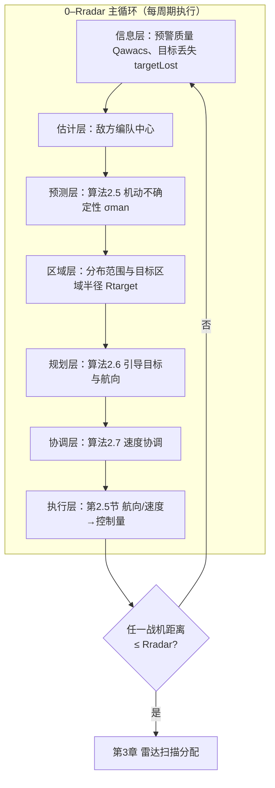
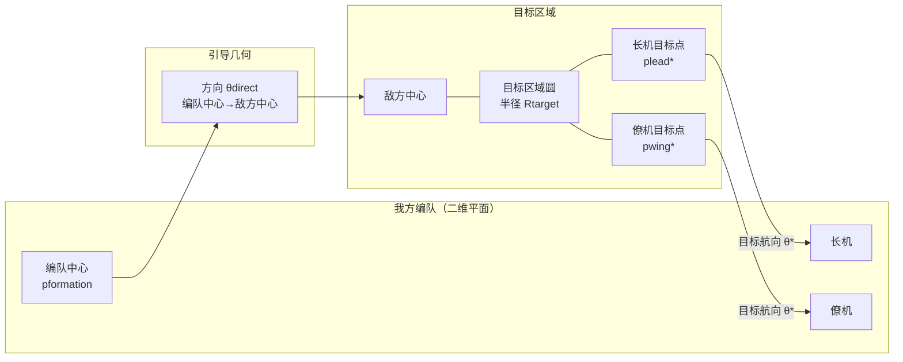
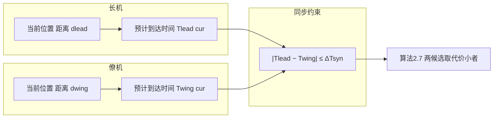
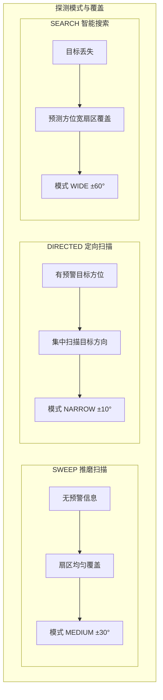

# <span style="color:red">多机协同探测决策算法设计</span>

**<span style="color:red">——面向CAP任务的编队级协同探测决策与雷达资源调度算法</span>**

---

## 摘要

针对预警机与战斗机火控雷达协同探测问题，本文面向空中巡逻（CAP）任务研究<span style="color:red">多机协同探测决策方法</span>。首先建立目标运动与观测的状态空间模型，并给出预警机信息不确定性的量化方式；其次考虑敌方机动不确定性，提出机动不确定性传播与置信域预测方法，将航向时变转化为可操作的时变置信区域；在此基础上将协同探测决策建模为带编队约束的优化问题，并给出满足实时性要求的分层滚动求解框架；最后给出进入火控雷达探测门限后的雷达扫描模式决策与扫描任务分配。算法设计覆盖敌方编队空间分布、高度与速度配置、机动动作以及预警机信息间歇与丢失等情形，具有通用性与鲁棒性。仿真验证部分针对具体对象与初始态势给出评价指标与算法分析曲线，验证了所提方法的有效性。

**关键词**：协同探测；<span style="color:red">协同探测决策</span>；编队协调；机动不确定性传播；置信域预测；IMM-EKF

---

## 目录

- [第1章 问题描述与建模](#第1章-问题描述与建模)
  - [1.1 协同探测决策问题定义](#11-协同探测决策问题定义)
  - [1.2 系统状态空间模型](#12-系统状态空间模型)
  - [1.3 优化目标与约束条件](#13-优化目标与约束条件)
- [第2章 协同探测决策算法设计](#第2章-协同探测决策算法设计)
  - [2.0 总体架构与滚动决策主循环](#20-总体架构与滚动决策主循环)
  - [2.1 信息可用性评估与不确定性量化](#21-信息可用性评估与不确定性量化)
  - [2.2 敌方编队中心与分布范围估计](#22-敌方编队中心与分布范围估计)
  - [2.3 编队级引导目标与航向分配算法](#23-编队级引导目标与航向分配算法)
  - [2.4 速度协调优化算法](#24-速度协调优化算法)
  - [2.5 单机控制量生成](#25-单机控制量生成)
  - [2.6 动态路径调整算法](#26-动态路径调整算法)
- [第3章 雷达扫描分配](#第3章-雷达扫描分配)
  - [3.1 探测模式决策](#31-探测模式决策)
  - [3.2 扫描任务分配](#32-扫描任务分配)
  - [3.3 扫描范围动态计算](#33-扫描范围动态计算)
- [第4章 仿真验证](#第4章-仿真验证)

---

# 第1章 问题描述与建模

本章建立<span style="color:red">协同探测决策</span>的问题描述、系统状态空间模型与优化目标及约束条件，为第2章、第3章的算法设计提供统一的形式化基础。全章仅使用符号与公式，具体参数取值在第4章仿真验证中给出。

## 1.1 <span style="color:red">协同探测决策</span>问题定义

### 1.1.1 研究背景

现代空战已进入超视距作战时代，战场态势感知能力成为制胜关键。预警机凭借其远距离探测能力可提供早期预警，但探测精度较低；战斗机火控雷达探测距离有限，但可提供高精度目标定位。因此，如何有效融合预警机与火控雷达两类信息源，实现从预警机粗略探测到火控雷达精确跟踪的快速转换，是当前亟待解决的关键技术问题。本文针对该问题建立数学模型，并在此基础上给出<span style="color:red">协同探测决策与雷达扫描分配</span>方法（第2章、第3章）。

### 1.1.2 问题描述

考虑由 $N$ 架战斗机组成的编队执行空中巡逻（Combat Air Patrol, CAP）任务（本文取 $N=4$ 的双机对编队形），<span style="color:red">编队依托预警机与战斗机火控雷达两类信息源（预警机提供远程目标信息，战斗机火控雷达为机载传感器）</span>。预警机具有远距离探测能力（探测距离记为 $R_{awacs}$），但位置精度较低（位置误差记为 $\sigma_{awacs}$），更新周期为 $T_{awacs}$；火控雷达探测距离较近（探测距离记为 $R_{radar}$，本文以进入该门限作为“到位”判据），但位置精度高（位置误差记为 $\sigma_{radar}$），扫描周期可变（由第3章体制参数确定）。两类传感器精度关系满足：

$$\sigma_{awacs} \gg \sigma_{radar}, \quad \Omega_{awacs} \gg \Omega_{radar}$$

其中 $\Omega_{awacs}=360°$ 为预警机视场角（全向），$\Omega_{radar} \in \{20°, 60°, 120°\}$ 为火控雷达方位扫描视场角（对应NARROW/MEDIUM/WIDE三档扫描模式；在第3章中亦采用等价的“方位半宽”表述 $\theta_{range}\in\{10^\circ,30^\circ,60^\circ\}$，满足 $\Omega_{radar}=2\theta_{range}$）。

**核心问题**：在动态对抗环境下，从预警机探测到目标到火控雷达建立稳定航迹这一阶段，如何规划编队的引导路径（航向、速度、编队协调），实现最短时间引导编队到达敌方大致位置，为后续雷达精确探测创造条件。

**决策边界**：本文研究的<span style="color:red">协同探测决策</span>算法作用范围明确界定为：**起点**为预警机首次探测到目标，**终点**为目标进入火控雷达探测范围（距离门限 $R_{radar}$）。主关注为 0–$R_{radar}$ 阶段的“预警引导协同探测”（航向/速度/编队协调）；进入 $R_{radar}$ 门限后，本文给出与该阶段衔接的雷达扫描模式与扫描分配策略（第3章），用于“到位后的截获与稳定跟踪”所需的资源调度，但不讨论武器发射与战术机动规划，相关环节通过高精度航迹接口与后续模块解耦。

### 1.1.3 关键挑战

<span style="color:red">协同探测决策</span>问题面临以下关键挑战：

1. **不确定性管理**：预警机位置误差较大（记为 $\sigma_{awacs}$），敌方编队可能呈现多种分布形态（密集、标准、分散、纵队、宽正面等），如何在大不确定性条件下准确估计敌方编队中心与分布范围是首要难题。

2. **编队协调约束**：4机编队采用双机对编队形（左编队A0100-A0200，右编队A0300-A0400），每对编队内存在长机-僚机关系，如何在拦截过程中保持编队关系并实现同步到达是核心挑战。

3. **速度协调优化**：初始状态下，长机航向0°（朝北），僚机航向180°（朝南），僚机距离敌方更近。进入拦截阶段时，需要决策"长机减速等僚机"还是"僚机加速追长机"，以实现编队同步到达。

4. **动态适应性**：敌方可能执行多种机动动作（直飞、转向、俯冲、爬升、蛇形摆动等），预警机信息可能间歇丢失，算法需具备动态适应能力。

5. **敌方编队多样性**：敌方编队可能呈现多种空间分布形态（密集排列、标准间距、分散排列、纵队排列、宽正面排列等）、多种高度分布（高高度、中高度、低高度、混合高度、阶梯高度、突现高度等）、多种速度配置（正常速度、低速、高速、加速、混合速度等），算法需通用适配所有情况。

6. **实时性要求**：决策周期≤0.2s，在线决策需满足实时运行约束。

### 1.1.4 任务场景约束

**重要约束（初始态势）**：在当前任务场景中，敌方**初始航向**固定为180°（正南向北的对头接近初态），但从仿真开始后敌方可根据机动策略在任意时刻改变航向与速度（如转向、蛇形、侧翼机动、诱饵佯动等），因此**敌方航向是时变且不确定的**。该约束意味着：算法设计不应依赖“来袭方向恒定”的假设，而应以**机动不确定性传播**为核心，通过对敌方未来可达域/置信域的滚动估计实现鲁棒引导。

**我方初始状态**：
- 编队配置：左编队（A0100长机+A0200僚机），右编队（A0300长机+A0400僚机）
- 初始航向：长机0°（朝北），僚机180°（朝南）
- <span style="color:red">初始位置：在算法设计中视为给定（可为任意满足任务约束的配置），具体数值在仿真验证（第4章）中给出</span>
- 巡逻状态：热段（长机，雷达开机）与冷段（僚机，雷达关机）交替

**敌方初始状态**：
- 初始航向：180°（正南向北的对头接近初态），但航向可随时间变化（机动不确定）
- 初始距离：300-400km（典型值300km）
- 编队空间分布：可能为密集排列、标准间距、分散排列、纵队排列、宽正面排列等任意一种
- 高度分布：可能为HIGH/MEDIUM/LOW/MIXED/STAIRCASE/POPUP中的任意一种
- 速度配置：可能为NORMAL/LOW/HIGH/ACCELERATING/MIXED中的任意一种

**图1.1 CAP任务场景与责任区示意图**（想定式俯视图，仅保留几何要素：上方为北向参考；我方四机以“两对编队”表示；目标簇为敌方初始位置；同心圆环/带状区域用于提示“距离门限/责任区层级”，其具体阈值含义由正文说明。）


上图展示了CAP任务的典型初始态势：我方4机编队采用冷热交替巡逻（长机雷达开机朝北，僚机雷达关机朝南），敌方编队从南向北接近（初始航向180°），初始距离300-400km。算法的作用范围为从预警机首次探测到目标进入火控雷达探测门限（$R_{radar}$）这一阶段，核心任务是在敌方机动不确定性条件下实现编队快速引导与协同探测。

---

## 1.2 系统状态空间模型

### 1.2.1 目标运动模型

为描述目标的机动特性，本文采用交互多模型（Interacting Multiple Model, IMM）方法，包含四个子模型：匀速直线运动（Constant Velocity, CV）、协调转弯（Coordinated Turn, CT）、匀加速运动（Constant Acceleration, CA）和Singer随机机动模型。IMM方法通过多个运动模型的并行运行和概率加权融合，能够自适应地<span style="color:red">估计</span>目标的多种机动模式，从而有效处理敌方机动不确定性。

**(1) 匀速直线运动模型（CV）**

CV模型假设目标在二维平面内以恒定速度做直线运动，适用于目标保持航向不变的情况。目标状态向量定义为 $\mathbf{x}_k = [x, \dot{x}, y, \dot{y}]^T$，其中 $(x, y)$ 为目标在二维平面内的位置坐标，$(\dot{x}, \dot{y})$ 为目标的速度分量。CV模型的状态方程为：

$$\mathbf{x}_{k+1} = \mathbf{F}_{CV} \mathbf{x}_k + \mathbf{G}_{CV} \mathbf{w}_k \tag{1.1}$$

其中状态转移矩阵 $\mathbf{F}_{CV}$ 描述了位置和速度在时间步长 $\Delta t$ 内的线性演化关系：位置分量等于上一时刻位置加上速度乘以时间步长，速度分量保持不变。过程噪声驱动矩阵 $\mathbf{G}_{CV}$ 将过程噪声 $\mathbf{w}_k$ 映射到状态空间，具体形式为：

$$\mathbf{F}_{CV} = \begin{bmatrix} 
1 & \Delta t & 0 & 0 \\ 
0 & 1 & 0 & 0 \\ 
0 & 0 & 1 & \Delta t \\ 
0 & 0 & 0 & 1 
\end{bmatrix}, \quad
\mathbf{G}_{CV} = \begin{bmatrix} 
\frac{\Delta t^2}{2} & 0 \\ 
\Delta t & 0 \\ 
0 & \frac{\Delta t^2}{2} \\ 
0 & \Delta t 
\end{bmatrix} \tag{1.2}$$

过程噪声 $\mathbf{w}_k \sim \mathcal{N}(\mathbf{0}, \mathbf{Q}_{CV})$ 为零均值高斯白噪声，用于建模目标运动中的随机扰动。协方差矩阵 $\mathbf{Q}_{CV} = q_{CV} \cdot \mathbf{I}$，其中 $q_{CV}$ 为过程噪声强度，$\mathbf{I}$ 为单位矩阵。

**(2) 协调转弯模型（CT）**

CT模型考虑目标以恒定角速度 $\omega$ 进行协调转弯机动，适用于目标执行转弯、盘旋等机动动作的情况。状态向量扩展为 $\mathbf{x}_k = [x, \dot{x}, y, \dot{y}, \omega]^T$（5维），增加了角速度 $\omega$ 作为状态分量。状态方程为：

$$\mathbf{x}_{k+1} = \mathbf{F}_{CT}(\omega) \mathbf{x}_k + \mathbf{G}_{CT} \mathbf{w}_k \tag{1.3}$$

其中 $\mathbf{F}_{CT}(\omega)$ 为依赖于转弯角速度的非线性状态转移矩阵，其形式考虑了转弯过程中速度方向的连续变化。<span style="color:red">$\mathbf{G}_{CT}$ 为过程噪声驱动矩阵，将过程噪声 $\mathbf{w}_k$ 映射到状态空间（与 CV 类似，具体形式取决于离散化与角速度维的噪声假设）</span>。当角速度 $\omega$ 接近零时，CT模型退化为CV模型。

**(3) 匀加速运动模型（CA）**

CA模型考虑目标加速度变化的情况，适用于目标执行加速、减速等机动动作。状态向量扩展为 $\mathbf{x}_k = [x, \dot{x}, \ddot{x}, y, \dot{y}, \ddot{y}]^T$（6维），增加了加速度分量 $(\ddot{x}, \ddot{y})$。状态方程为：

$$\mathbf{x}_{k+1} = \mathbf{F}_{CA} \mathbf{x}_k + \mathbf{G}_{CA} \mathbf{w}_k \tag{1.4}$$

<span style="color:red">其中 $\mathbf{G}_{CA}$ 为过程噪声驱动矩阵，将过程噪声映射到状态空间（通常作用于加速度分量）</span>。状态转移矩阵 $\mathbf{F}_{CA}$ 描述了位置、速度和加速度之间的积分关系：速度等于上一时刻速度加上加速度乘以时间步长，位置等于上一时刻位置加上速度乘以时间步长再加上加速度乘以时间步长的平方的一半。

**(4) Singer随机机动模型**

Singer模型考虑目标机动的随机性，采用一阶时间相关模型描述加速度变化。该模型假设目标的加速度是一个一阶马尔可夫过程，能够更好地描述目标机动的连续性和随机性，适用于目标执行复杂随机机动的情况。

**(5) 模型转移概率**

IMM方法通过马尔可夫链描述不同运动模型之间的转移关系。四个模型之间的转移概率由马尔可夫转移概率矩阵 $\boldsymbol{\Pi}$ 描述：

$$\boldsymbol{\Pi} = \begin{bmatrix} 
\pi_{11} & \pi_{12} & \pi_{13} & \pi_{14} \\ 
\pi_{21} & \pi_{22} & \pi_{23} & \pi_{24} \\ 
\pi_{31} & \pi_{32} & \pi_{33} & \pi_{34} \\ 
\pi_{41} & \pi_{42} & \pi_{43} & \pi_{44} 
\end{bmatrix} \tag{1.5}$$

其中 $\pi_{ij}$ 表示从模型 $i$ 转移到模型 $j$ 的概率，满足概率归一化条件 $\sum_{j=1}^{4} \pi_{ij} = 1$。该转移矩阵反映了目标在不同机动模式之间切换的可能性，对角线元素 $\pi_{ii}$ 通常较大，表示目标倾向于保持当前机动模式。

### 1.2.2 传感器观测模型

传感器观测模型描述了预警机和火控雷达对目标状态的测量过程，将目标在笛卡尔坐标系中的状态（位置、速度等）转换为传感器坐标系中的观测值（距离、方位角等），并考虑测量误差的影响。

**(1) 预警机观测模型**

预警机作为远程探测平台，能够提供目标相对于预警机位置的极坐标观测值，包括距离和方位角。观测方程为：

$$\mathbf{z}_k^{awacs} = \mathbf{h}_{awacs}(\mathbf{x}_k) + \mathbf{v}_k^{awacs} \tag{1.6}$$

其中观测函数 $\mathbf{h}_{awacs}(\mathbf{x})$ 将目标在笛卡尔坐标系中的位置 $(x, y)$ 转换为极坐标系中的距离和方位角：

$$\mathbf{h}_{awacs}(\mathbf{x}) = \begin{bmatrix} 
\sqrt{x^2 + y^2} \\ 
\operatorname{atan2}(x, y)
\end{bmatrix} \tag{1.7}$$

观测函数的第一行计算目标到预警机的欧氏距离，第二行计算目标相对于预警机的方位角（以正北方向为0°，顺时针为正）。观测噪声 $\mathbf{v}_k^{awacs} \sim \mathcal{N}(\mathbf{0}, \mathbf{R}_{awacs})$ 为零均值高斯白噪声，其协方差矩阵为 $\mathbf{R}_{awacs} = \operatorname{diag}(\sigma_{awacs}^2, \sigma_{\theta,awacs}^2)$，其中 $\sigma_{awacs}$ 为距离测量精度（标准差），$\sigma_{\theta,awacs}$ 为方位角测量精度（标准差）。<span style="color:red">（算法设计阶段不指定具体数值；具体取值在仿真验证中给出。）</span>

**(2) 火控雷达观测模型**

第 $i$ 架战机的火控雷达观测模型与预警机类似，但观测值是相对于战机自身位置的。观测方程为：

$$\mathbf{z}_k^{radar,i} = \mathbf{h}_{radar}(\mathbf{x}_k, \mathbf{x}_i) + \mathbf{v}_k^{radar} \tag{1.9}$$

其中 $\mathbf{x}_i = [x_i, y_i]^T$ 为第 $i$ 架战机在笛卡尔坐标系中的位置，观测函数为：

$$\mathbf{h}_{radar}(\mathbf{x}, \mathbf{x}_i) = \begin{bmatrix} 
\sqrt{(x-x_i)^2 + (y-y_i)^2} \\ 
\operatorname{atan2}(x-x_i, y-y_i)
\end{bmatrix} \tag{1.10}$$

观测函数的第一行计算目标到第 $i$ 架战机的相对距离，第二行计算目标相对于战机的方位角。观测噪声 $\mathbf{v}_k^{radar} \sim \mathcal{N}(\mathbf{0}, \mathbf{R}_{radar})$ 为零均值高斯白噪声，其协方差矩阵为 $\mathbf{R}_{radar} = \operatorname{diag}(\sigma_{radar}^2, \sigma_{\theta,radar}^2)$，其中 $\sigma_{radar}$、$\sigma_{\theta,radar}$ 分别为距离与方位角测量精度。<span style="color:red">（具体取值在仿真验证中给出。）</span>

**精度关系**：两类传感器满足 $\sigma_{awacs} \gg \sigma_{radar}$、$\sigma_{\theta,awacs} \gg \sigma_{\theta,radar}$，火控雷达测量精度高于预警机，预警机探测距离更远，两者形成互补关系。

### 1.2.3 IMM-EKF状态估计算法（用于置信域预测）

<span style="color:red">本节给出 IMM-EKF 状态估计算法，其作用是为第2章置信域预测提供当前时刻的目标状态估计与协方差 $\mathbf{P}$，从而将目标机动不确定性纳入可计算的置信域构造中；第2.2.3节将利用该协方差进行无量测预测并得到置信半径。</span>为把敌方机动不确定性纳入可计算框架，本文采用 **IMM-EKF** 对目标进行多模型状态估计。IMM-EKF由“模型交互（混合）—并行EKF—概率更新—融合输出”四步组成。

设共有 $M_{imm}=4$ 个机动模型（CV/CT/CA/Singer），模型转移矩阵为 $\boldsymbol{\Pi}=[\pi_{ij}]$，第 $m$ 个模型在时刻 $k$ 的状态与协方差为 $(\hat{\mathbf{x}}_{k}^{(m)},\mathbf{P}_{k}^{(m)})$，模型概率为 $\mu_k^{(m)}$。

**算法1.1 IMM-EKF状态估计（单目标）**

**算法作用**：对单目标在单次量测下执行一次完整 IMM 步，输出当前时刻的融合状态 $\hat{\mathbf{x}}_k$ 与协方差 $\mathbf{P}_k$，供第2章置信域预测与敌方中心估计使用。步骤分为四段：① 模型混合（按转移概率得到各模型混合初值）；② 各模型 EKF 预测与量测更新；③ 用创新似然更新模型概率；④ 按模型概率加权融合输出。

**输入**：上一时刻各模型状态/协方差/概率 $\{(\hat{\mathbf{x}}_{k-1}^{(m)},\mathbf{P}_{k-1}^{(m)},\mu_{k-1}^{(m)})\}$，转移矩阵 $\boldsymbol{\Pi}$，当前观测 $\mathbf{z}_k$（预警机或雷达），过程噪声 $\{\mathbf{Q}^{(m)}\}$，观测噪声 $\mathbf{R}$。  
**输出**：融合状态 $\hat{\mathbf{x}}_k$，融合协方差 $\mathbf{P}_k$，各模型后验 $\{(\hat{\mathbf{x}}_k^{(m)},\mathbf{P}_k^{(m)},\mu_k^{(m)})\}$。

1.  for $j$ ← 1 to $M_{imm}$ do  // ① 模型混合：对每个模型 $j$，计算其混合初值（状态与协方差）
2.      $c_{bar}(j)$ ← $\Sigma_i$ $\pi_{ij}$ $\mu_{k-1}^{(i)}$  // 混合权重归一化常数：所有模型转移到模型 $j$ 的概率加权和
3.      for $i$ ← 1 to $M_{imm}$ do  $\mu_{k-1}^{(i|j)}$ ← $\pi_{ij}$ $\mu_{k-1}^{(i)}$ / $c_{bar}(j)$  // 混合概率：模型 $i$ 在给定模型 $j$ 下的条件概率
4.      $\mathbf{x}_{0,j}$ ← $\Sigma_i$ $\mu_{k-1}^{(i|j)}$ $\hat{\mathbf{x}}_{k-1}^{(i)}$  // 混合状态：按混合概率加权融合各模型上一时刻状态，作为模型 $j$ 的预测初值
5.      $\mathbf{P}_{0,j}$ ← $\Sigma_i$ $\mu_{k-1}^{(i|j)}$[ $\mathbf{P}_{k-1}^{(i)}$ + ($\hat{\mathbf{x}}_{k-1}^{(i)}$−$\mathbf{x}_{0,j}$)(·)$^T$ ]  // 混合协方差：含各模型协方差与状态误差外积项，保证协方差一致性
6.  for $j$ ← 1 to $M_{imm}$ do  // ② 各模型 EKF 预测与量测更新：对每个模型独立执行 EKF 一步
7.      $\mathbf{x}_{pred,j}$ ← $\mathbf{f}^{(j)}$($\mathbf{x}_{0,j}$);  $\mathbf{P}_{pred,j}$ ← $\mathbf{F}^{(j)}$ $\mathbf{P}_{0,j}$ $\mathbf{F}^{(j)T}$ + $\mathbf{Q}^{(j)}$  // EKF 预测：用模型 $j$ 的非线性/线性状态转移函数预测状态与协方差
8.      $\mathbf{K}_j$ ← $\mathbf{P}_{pred,j}$ $\mathbf{H}^T$ ($\mathbf{H}$ $\mathbf{P}_{pred,j}$ $\mathbf{H}^T$ + $\mathbf{R}$)$^{-1}$  // 卡尔曼增益：权衡预测协方差与观测噪声，决定量测更新的权重
9.      $\hat{\mathbf{x}}_k^{(j)}$ ← $\mathbf{x}_{pred,j}$ + $\mathbf{K}_j$ ($\mathbf{z}_k$ − $\mathbf{h}$($\mathbf{x}_{pred,j}$));  $\mathbf{P}_k^{(j)}$ ← ($\mathbf{I}$ − $\mathbf{K}_j$ $\mathbf{H}$) $\mathbf{P}_{pred,j}$  // 状态更新：用创新（量测残差）修正预测状态；协方差更新：量测后不确定性减小
10.     $\boldsymbol{\nu}_j$ ← $\mathbf{z}_k$ − $\mathbf{h}$($\mathbf{x}_{pred,j}$);  $\mathbf{S}_j$ ← $\mathbf{H}$ $\mathbf{P}_{pred,j}$ $\mathbf{H}^T$ + $\mathbf{R}$  // ③ 创新及创新协方差：$\boldsymbol{\nu}_j$ 为量测残差，$\mathbf{S}_j$ 为残差协方差，用于计算模型似然
11.     $\Lambda_j$ ← $\mathcal{N}$($\boldsymbol{\nu}_j$; 0, $\mathbf{S}_j$);  $\mu_k^{(j)}$ ← $\Lambda_j$ $c_{bar}(j)$ / $\Sigma_\ell$ $\Lambda_\ell$ $c_{bar}(\ell)$  // 模型概率更新：$\Lambda_j$ 为模型 $j$ 的似然（创新为0的概率密度），按贝叶斯公式更新模型概率
12. $\hat{\mathbf{x}}_k$ ← $\Sigma_j$ $\mu_k^{(j)}$ $\hat{\mathbf{x}}_k^{(j)}$  // ④ 融合状态：按更新后的模型概率加权融合各模型状态，得到最终估计
13. $\mathbf{P}_k$ ← $\Sigma_j$ $\mu_k^{(j)}$[ $\mathbf{P}_k^{(j)}$ + ($\hat{\mathbf{x}}_k^{(j)}$−$\hat{\mathbf{x}}_k$)(·)$^T$ ]  // 融合协方差：含各模型协方差与状态误差外积项，保证融合协方差的一致性
14. return ($\hat{\mathbf{x}}_k$, $\mathbf{P}_k$, $\{\hat{\mathbf{x}}_k^{(j)}, \mathbf{P}_k^{(j)}, \mu_k^{(j)}\}$)  // 返回融合状态、融合协方差，以及各模型的后验状态、协方差与概率（供下一时刻使用）

（式中 (·)$^T$ 表示前一项误差向量与其转置的外积，即 $\mathbf{P}_{k-1}^{(i)}$+($\hat{\mathbf{x}}_{k-1}^{(i)}$−$\mathbf{x}_{0,j}$)($\hat{\mathbf{x}}_{k-1}^{(i)}$−$\mathbf{x}_{0,j}$)$^T$ 与融合时的类似项。）
在单目标、单次量测下，对多模型（CV/CT/CA/Singer）做一次完整的 IMM 步：先按转移概率混合各模型上一时刻的状态与协方差得到各模型的混合初值；再对每个模型做 EKF 预测与更新，并用当前量测的创新似然更新模型概率；最后按模型概率加权融合得到当前时刻的融合状态与协方差，供第2章置信域预测与滤波递推使用。

---

## 1.3 优化目标与约束条件

### 1.3.1 优化目标函数

<span style="color:red">协同探测决策</span>的总体目标是在满足约束条件下，最小化加权代价函数：

$$\min_{\{\theta_i(t), v_i(t)\}} J = \alpha_1 \cdot T_{max} + \alpha_2 \cdot C_{formation} + \alpha_3 \cdot C_{fuel} + \alpha_4 \cdot P_{miss} \tag{1.12}$$

其中：
- <span style="color:red">$T_{max} = \max_i T_i$：编队中最后一架战机到达目标区域的时刻（即全队到位时间）</span>
- <span style="color:red">$C_{formation} = \sum_i \sum_{j \in \mathcal{N}_i} ||\mathbf{p}_i(T_i) - \mathbf{p}_j(T_j)||^2$：编队协调代价。其中 $\mathbf{p}_i(T_i)$ 为战机 $i$ 在时刻 $T_i$（其到达目标区域的时刻）的位置向量，$\mathbf{p}_j(T_j)$ 同理；$\mathcal{N}_i$ 为与第 $i$ 架战机同编队对的伙伴集合（即与 $i$ 同属一对长机-僚机的另一架）</span>
- $C_{fuel} = \sum_i \int_0^{T_i} |v_i(t) - v_{nominal}|^2 dt$：燃料消耗代价，$v_{nominal}$ 为标称速度
- $P_{miss}$：目标丢失概率，定义为在拦截过程中目标超出置信区域的概率
- $\{\theta_i(t), v_i(t)\}$：决策变量集合，包括每架战机的航向序列和速度序列
- $\alpha_1, \alpha_2, \alpha_3, \alpha_4$：权重系数，反映不同目标的相对重要性

**到达时间定义**：第 $i$ 架战机到达目标区域的时间 $T_i$ 定义为：

$$T_i = \min \{t : ||\mathbf{p}_i(t) - \hat{\mathbf{p}}_{enemy}|| \leq R_{target}\} \tag{1.13}$$

其中 $\hat{\mathbf{p}}_{enemy}$ 为估计的敌方编队中心，$R_{target}$ 为目标区域半径（考虑预警机误差和敌方分布范围）。

### 1.3.2 约束条件

<span style="color:red">协同探测决策</span>优化问题需满足以下约束条件：

**(1) 速度约束**

每架战机的速度需在允许范围内：

$$v_{min} \leq v_i(t) \leq v_{max}, \quad \forall i, \forall t \in [0, T_i] \tag{1.14}$$

其中 $v_{min}$ 和 $v_{max}$ 为战机的最小和最大速度限制。

**(2) 航向变化率约束**

航向变化需满足物理限制：

$$|\theta_i(t+\Delta t) - \theta_i(t)| \leq \Delta\theta_{max} \cdot \Delta t, \quad \forall i, \forall t \tag{1.15}$$

其中 $\Delta\theta_{max}$ 为最大航向变化率（度/秒），$\Delta t$ 为时间步长。

**(3) 加速度约束**

速度变化需满足加速度限制：

$$|v_i(t+\Delta t) - v_i(t)| \leq a_{max} \cdot \Delta t, \quad \forall i, \forall t \tag{1.16}$$

其中 $a_{max}$ 为最大加速度限制。

**(4) 编队安全距离约束**

编队内战机需保持安全距离：

$$||\mathbf{p}_i(t) - \mathbf{p}_j(t)|| \geq d_{safe}, \quad \forall i, j \in \mathcal{N}_i, \forall t \tag{1.17}$$

<span style="color:red">其中 $\mathbf{p}_i(t)$、$\mathbf{p}_j(t)$ 为第 $i$、$j$ 架战机在时刻 $t$ 的位置向量（二维平面坐标），</span>$d_{safe}$ 为最小安全距离。

**(5) 编队同步到达约束**

同一编队内的战机到达时间差需在允许范围内：

$$|T_i - T_j| \leq \Delta T_{sync}, \quad \forall i, j \in \mathcal{N}_i \tag{1.18}$$

其中 $\Delta T_{sync}$ 为允许的最大同步时间差。<span style="color:red">（具体取值在仿真验证中给出。）</span>

**(6) 目标区域覆盖约束**

所有战机的引导路径需覆盖敌方可能出现的置信区域：

$$\bigcup_{i=1}^{N} \{\mathbf{p}_i(t) : t \in [0, T_i]\} \supseteq \mathcal{R}_{enemy} \tag{1.19}$$

其中 $\mathcal{R}_{enemy}$ 为敌方可能出现的置信区域（考虑预警机误差和敌方分布范围）。

### 1.3.3 分层近似求解思路（与目标函数的一致性）

为使式(1.12)与后文算法一一对应，本文在算法设计中采用“**目标函数—子问题—求解流程**”的一致化映射：将式(1.12)拆解为若干可在线求解的子目标，并在滚动时域内近似最优。

- **时间最优项 $T_{acq}$**：对应第2章“规划层+协调层”。算法2.6给出编队级引导目标点 $\mathbf{p}_i^{\ast}$ 与 $\theta_i^{\ast}$ 的构造，算法2.7通过同步到达约束（$\max_i T_i$ 近似）抑制“长机等待/僚机掉队”导致的到达时间恶化，从而在在线可解的滚动框架下逼近最小截获时间。
- **资源代价项 $C_{resource}$**：对应第3章“雷达资源调度”。通过将扫描模式视为离散决策变量，构造模式效用 $U(mode)$（见第3.1节模式选择模型），在满足截获概率的前提下降低扫描周期/覆盖角引起的资源消耗。
- **丢失概率项 $P_{miss}$**：对应第2章“预测层+区域层”与第3章“搜索模式”。式(2.4a)–(2.4d)把敌方机动与信息间歇丢失映射为置信域膨胀 $\sigma_{man}(t)$，从而把“丢失风险”转化为可计算的覆盖约束（式(1.19)、式(3.2)/(3.3)）。

本文采用**分层滚动决策框架**（每周期按“信息→估计→预测→区域→规划→协调→执行”顺序更新），并结合**离散候选集上的枚举与代价比较**进行在线求解：例如扫描模式在集合 $\{\text{NARROW},\text{MEDIUM},\text{WIDE}\}$ 上取效用最大者（第3.1节），分散角在离散候选集 $\mathcal{D}=\{0°,5°\}$ 上选取（第3.2.2节由覆盖约束推导），航向/速度由算法2.6/2.7 给出。该方式用离散搜索与解析构造替代全局连续优化，每一步均由明确的目标与约束驱动，满足实时性要求。下面第2章在上述模型与约束基础上，给出<span style="color:red">协同探测决策</span>的具体算法设计。

---

# 第2章 <span style="color:red">协同探测决策</span>算法设计

根据第1章建立的优化目标与约束条件，协同探测决策采用分层滚动方式：<span style="color:red">在每个决策周期内基于当前置信域与约束更新编队引导与速度协调；式(1.12)为理想化的全局优化目标，因实时性与可解性约束，本文通过滚动实施在有限时域内逼近该目标，而非保证全局最小</span>。本章给出上述问题的分层滚动求解框架及信息可用性评估、敌方编队估计、机动不确定性传播与置信域预测、<span style="color:red">编队级引导目标与航向分配</span>、速度协调与动态路径调整等核心算法。本章不引入具体仿真场景参数与初始态势，相关设置统一在第4章给出。

## 2.0 总体架构与滚动决策主循环

为突出“从预警引导到 $R_{radar}$ 门限”的主任务，并显式处理“敌方航向时变”的机动不确定性，本文采用分层滚动（Receding Horizon）决策框架：每个决策周期 $k$（典型 0.2s）基于最新预警信息与己方状态，更新敌方置信域并重新计算编队级引导目标与速度协调策略；当编队中任一战机与敌方中心距离不大于 $R_{radar}$ 时，切换至第3章雷达扫描分配流程。总体流程如下。

**算法 0 协同探测分层滚动决策主循环（0–$R_{radar}$ 主任务）**

**算法作用**：每个决策周期（如 0.2 s）按“信息→估计→预测→区域→规划→协调→执行”顺序执行一遍，输出每机飞行引导指令；当任一战机与敌方中心距离 ≤ $R_{radar}$ 时切换至第3章雷达扫描分配。本算法是 0–$R_{radar}$ 阶段的总调度，不直接解优化，而是调用算法2.5/2.6/2.7 完成置信域、引导目标与速度协调。

**输入**：预警机航迹 $\mathcal{Z}_k$（目标位置与最后更新时间），我方状态 $\mathcal{S}_k^F$（各机位置、航向、速度），当前时间 $t_k$。  
**输出**：每机飞行引导指令 $\mathbf{u}_{i,k}^{fly}=(\theta_i^{\ast},v_i^{\ast})$；若已进入 $R_{radar}$ 门限则含雷达扫描指令 $\mathbf{u}_{i,k}^{scan}$。

1.  $Q_{awacs}$ ← 按式(2.1)计算；$target_{lost}$ ← 按式(2.2)判据  // 信息层：预警质量与丢失标志
2.  $\hat{\mathbf{p}}_{enemy}$ ← 基于 $\mathcal{Z}_k$ 更新（第2.2.1节）  // 估计层：敌方编队中心
3.  $\sigma_{man}(t_k)$ ← 算法2.5  // 预测层：机动不确定性传播与置信半径
4.  $\sigma_{enemy}(t_k)$, $R_{target}(t_k)$ ← 第2.2.2节  // 区域层：分布范围与目标区域半径
5.  $\{\mathbf{p}_i^{\ast}, \theta_i^{\ast}\}$ ← 算法2.6（编队级引导目标与航向）  // 规划层：每机目标点与目标航向
6.  $\{v_i^{\ast}\}$ ← 算法2.7（速度协调）  // 协调层：满足同步到达的速度
7.  for $i$ ← 1 to $N$ do  $\mathbf{u}_{i}^{fly}$ ← 将 ($\theta_i^{\ast}$, $v_i^{\ast}$) 转为航向/速度控制量（第2.5节）  // 执行层：目标航向/速度→控制量
8.  if $\min_i$ $\|\mathbf{p}_i - \hat{\mathbf{p}}_{enemy}\|$ ≤ $R_{radar}$ then  进入第3章扫描分配，得到 $\mathbf{u}_{i}^{scan}$  // 门限判断：到位则切雷达扫描
9.  return $\{\mathbf{u}_{i}^{fly}\}$（及可选的 $\mathbf{u}_{i}^{scan}$）

每个决策周期（如 0.2 s）按“信息→估计→预测→区域→规划→协调→执行”顺序更新一次：先评估预警机信息质量与目标是否丢失，再估计敌方中心与置信域，接着用算法2.5/2.6/2.7 得到编队级引导目标、航向与协调速度，并转为单机控制量；当任一战机与敌方中心距离不大于 $R_{radar}$ 时切换至第3章雷达扫描流程。该主循环将机动不确定性通过“预测层→区域层”映射为可计算的置信域，在预警丢失或敌方机动时仍能鲁棒引导编队到位。<span style="color:red">可将本阶段的协同探测理解为超视距作战中的接敌引导与目标搜索阶段，与后续火控截获、武器运用等研究自然衔接。</span>

**图1 协同探测决策总体流程图**（0–$R_{radar}$ 主循环：信息层→估计层→预测层→区域层→规划层→协调层→执行层，每周期执行一次；符号对应：$Q_{awacs}$、$target_{lost}$，$\hat{\mathbf{p}}_{enemy}$，$\sigma_{man}$，$R_{target}$，$\mathbf{p}_i$，$R_{radar}$。）



## 2.1 信息可用性评估与不确定性量化

### 2.1.1 预警机信息质量评估

在 0–$R_{radar}$ 阶段，尚未形成机载雷达高精度航迹，难以对空战态势优势与威胁做完整评估。因而本文在设计层面仅引入**信息可用性与可靠性评估**，即对预警机信息的可用性、精度与时效性进行量化，为后续“置信域构造—引导与航向分配—速度协同”提供输入。定义预警机信息质量指标：

$$Q_{awacs} = \operatorname{clip}\left(1 - \frac{\sigma_{awacs}}{d_{min}},\,0,\,1\right) \tag{2.1}$$

其中 $d_{min} = \min_j \|\mathbf{p}_j^{awacs}-\mathbf{p}_{formation}\|$ 为编队中心到各预警目标的最小距离，$\operatorname{clip}(a,\,0,\,1)$ 表示将 $a$ 限制在 $[0,1]$ 内。该指标反映预警机信息精度相对于目标距离的比值，值越大表示信息质量越高。给定预警机目标位置集合 $\{\mathbf{p}_j^{awacs}\}$ 与我方编队中心 $\mathbf{p}_{formation}$，先计算 $d_{min}$，再按式(2.1)得到 $Q_{awacs}$。

### 2.1.2 目标丢失检测

目标丢失检测是触发SEARCH模式的关键。定义目标丢失判据：

$$target_{lost} = \begin{cases}
\text{True}, & \text{if } \max_j (t_{current} - t_j^{last}) > T_{lost} \\
\text{False}, & \text{otherwise}
\end{cases} \tag{2.2}$$

其中 $t_j^{last}$ 为目标 $j$ 的最后更新时间，$T_{lost}$ 为丢失判定阈值。<span style="color:red">（具体取值在仿真验证中给出。）</span>

**判据与计算方法**：对每个目标维护其最近一次预警更新时间戳 $t_j^{last}$。给定当前时间 $t_{current}$，若存在目标满足 $(t_{current}-t_j^{last})>T_{lost}$，则判定该目标预警信息已丢失并置 $target_{lost}=\mathrm{True}$；否则 $target_{lost}=\mathrm{False}$。其输出用于滚动引导的保守化以及第3章 SEARCH 模式的触发。

**图2d 预警质量与目标丢失判据示意图**（左：信息质量 $Q_{awacs}$ 的直觉解释；右：以时间差 $\Delta t$ 与阈值 $T_{awacs}$、$T_{lost}$ 划分 stale 与 lost，用于触发 SEARCH。图内仅保留关键词与几何/时间关系，公式含义由正文说明。）


---

## 2.2 敌方编队中心与分布范围估计

### 2.2.1 敌方编队中心估计

敌方编队中心估计是<span style="color:red">协同探测决策中引导目标与航向分配</span>的基础。考虑预警机位置误差为 $\sigma_{awacs}$、各目标探测误差相互独立，采用等权重算术平均方法估计编队中心：

$$\hat{\mathbf{p}}_{enemy} = \frac{1}{M}\sum_{j=1}^{M} \mathbf{p}_j^{awacs} \tag{2.3}$$

等权重平均在探测误差相同时可最大化信息利用效率；估计误差为 $\sigma_{estimate} = \sigma_{awacs}/\sqrt{M}$（多目标平均降低误差，符合统计规律）。当预警机仅探测到部分目标时，该估计方法仍能给出合理的中心估计。

### 2.2.2 敌方分布范围估计

敌方分布范围估计需综合考虑编队空间分布、预警机误差与机动不确定性。定义分布范围指标：

$$\sigma_{enemy}(t) = \max(\sigma_{spatial}(t), \sigma_{awacs}) + \sigma_{man}(t) \tag{2.4}$$

其中：
- $\sigma_{spatial} = \sqrt{\frac{1}{M}\sum_{j=1}^{M} ||\mathbf{p}_j^{awacs} - \hat{\mathbf{p}}_{enemy}||^2}$：目标位置的空间分散度（当 $M=1$ 时取默认值 $\sigma_{default}$，由编队空间分布设定）<span style="color:red">；具体取值在仿真验证中给出</span>
- $\sigma_{awacs}$：预警机位置误差（作为分布范围的下界）
- $\sigma_{man}(t)$：机动不确定性增量（由无量测预测与机动模型引起的时变膨胀项，见第2.2.3节）

置信区域半径为 $R_{target} = k_\sigma \cdot \sigma_{enemy}$，其中 $k_\sigma$ 为覆盖系数（对应给定置信度 $\gamma$ 下的覆盖）。<span style="color:red">（具体取值在仿真验证中给出。）</span>

**编队空间分布自适应处理**：当预警机仅探测到部分目标时，根据探测到的目标数量推断编队空间分布：$M=1$ 时取 $\sigma_{default}$（密集排列）；$M=2$ 时取 $\sigma_{default}$（中等间距）；$M\ge 4$ 时使用实际计算的 $\sigma_{spatial}$。$\sigma_{default}$ 的具体取值在仿真中根据场景设定。

**图2e 敌方中心估计与目标区域 $R_{target}$ 构造示意图**（橙色散点表示预警测量散布（对应 $\sigma_{awacs}$）；黑点为中心估计 $\hat{\mathbf{p}}_{enemy}$；红色圆为目标区域半径 $R_{target}$（融合 $\sigma_{awacs}$、$\sigma_{man}$ 等不确定性后的保守包络）。该示意强调“测量越散/机动越强 → 区域越大”。）


---

### 2.2.3 机动不确定性传播与置信域预测（敌方航向时变）

<span style="color:red">**术语说明**：**预警间歇丢失**指预警机更新不及时或链路中断，在一段时间内无新量测；**连续机动**指目标在该段时间内持续机动（如转弯、加速），其真实位置相对上次估计的偏差会随时间增大。若仅以“当前预警位置分散度 + 固定余量”构造目标区域，无法覆盖上述情形下目标可能到达的范围。</span>为此，本节将敌方机动不确定性显式建模为**无量测预测下的协方差增长**，并将其转化为随时间膨胀的置信域。

对目标 $j$ 的状态估计 $(\hat{\mathbf{x}}_{j,k}, \mathbf{P}_{j,k})$，在 $\tau=t-t_k$ 的无量测预测窗口内（例如预警更新周期、间歇丢失窗口），其预测协方差按滤波预测方程传播：

$$\hat{\mathbf{x}}_{j}(t|t_k)=\mathbf{f}\big(\hat{\mathbf{x}}_{j,k},\tau\big), \qquad
\mathbf{P}_{j}(t|t_k)=\mathbf{F}_{j}(\tau)\mathbf{P}_{j,k}\mathbf{F}_{j}(\tau)^T+\mathbf{Q}_{j}(\tau) \tag{2.4a}$$

其中 $\mathbf{F}_{j}(\tau)$ 为线性化雅可比（或模型矩阵），$\mathbf{Q}_{j}(\tau)$ 为过程噪声协方差，反映机动强度上界（CV/CT/CA/Singer 等模型由IMM加权融合）。提取二维位置协方差子矩阵 $\mathbf{P}_{pos,j}(t|t_k)\in\mathbb{R}^{2\times 2}$，<span style="color:red">定义置信度</span> $\gamma$<span style="color:red">（如 0.99，自由度2）对应的卡方阈值</span> $\chi^2_\gamma$，则位置置信椭圆满足：

$$\mathcal{E}_{j}(t)=\left\{\mathbf{p}:(\mathbf{p}-\hat{\mathbf{p}}_{j})^T\mathbf{P}_{pos,j}(t|t_k)^{-1}(\mathbf{p}-\hat{\mathbf{p}}_{j})\le \chi^2_\gamma\right\} \tag{2.4b}$$

<span style="color:red">后续引导与目标区域采用圆形（半径 </span>$R_{target}$<span style="color:red">）描述；置信椭圆为任意朝向的椭圆。为与圆形目标区域一致，将椭圆用其外接圆近似，半径取椭圆最大半轴对应的置信半径</span>：

$$r_{j}(t)=\sqrt{\chi^2_\gamma\cdot \lambda_{\max}\!\left(\mathbf{P}_{pos,j}(t|t_k)\right)} \tag{2.4c}$$

并定义机动不确定性增量为所有目标外接圆半径的上界：

$$\sigma_{man}(t)=\max_{j} r_{j}(t) \tag{2.4d}$$

据此，式(2.4)中的 $\sigma_{man}(t)$ 自动体现“机动越强/丢失越久，目标区域越大”的规律；预警恢复或雷达量测进入后，$\mathbf{P}_{pos}$ 收缩，$\sigma_{man}(t)$ 随之减小，从而使引导策略自适应收敛。

**图2c 无量测预测下的不确定性膨胀/收敛示意**（横轴为时间、纵轴为不确定性幅度的抽象表示。无新量测时不确定性随时间扩大（对应协方差传播与 $r_j(t)$ 增大）；量测更新到来后不确定性收敛（对应协方差更新与 $r_j(t)$ 减小）。该示意图用于帮助理解式(2.4a)–(2.4d) 与“预警间歇丢失/目标机动”对 $R_{target}$ 的影响。）


**算法2.5 机动不确定性传播与置信域预测算法**

**算法作用**：在无新量测的时间段内，用 IMM 预测方程将各目标位置协方差向前传播，得到 $t$ 时刻的位置不确定性（置信椭圆），再按置信度 $\gamma$ 用最大特征值构造外接圆半径 $r_j(t)$，并取所有目标的上界作为 $\sigma_{man}(t)$，供第2.2.2节构造 $R_{target}$。预警更新或雷达量测进入后协方差收缩，$\sigma_{man}(t)$ 随之减小，引导策略自适应收敛。

**输入**：各目标当前状态与协方差 $\{(\hat{\mathbf{x}}_{j,k},\mathbf{P}_{j,k},t_k)\}$，当前时间 $t$，置信度 $\gamma$（如 0.99），IMM 过程噪声 $\{\mathbf{Q}_m\}$。  
**输出**：机动不确定性增量 $\sigma_{man}(t)$，各目标预测置信半径 $\{r_j(t)\}$。

1.  for $j$ ← 1 to $M$ do
2       $\tau_j$ ← $t$ − $t_k$ // 按式(2.4a)：用 IMM 无量测预测得到 $t$ 时刻的位置协方差（从全状态协方差提取 2×2 位置子块）
3       $\mathbf{P}_{pos,j}(t|t_k)$ ← IMM 预测位置协方差($\hat{\mathbf{x}}_{j,k}$, $\mathbf{P}_{j,k}$, $\tau_j$, $\{\mathbf{Q}_m\}$)
4       $r_j(t)$ ← $\sqrt{\chi^2_\gamma \cdot \lambda_{\max}(\mathbf{P}_{pos,j}(t|t_k))}$  // 式(2.4c)：置信椭圆外接圆半径
5   $\sigma_{man}(t)$ ← $\max_j$ $r_j(t)$ // 式(2.4d)：机动不确定性增量取所有目标置信半径的上界
6   return ($\sigma_{man}(t)$, $\{r_j(t)\}$)


在无新量测的时间段内，用 IMM 预测方程将各目标位置协方差向前传播，得到 $t$ 时刻的位置不确定性椭圆；再按给定置信度 $\gamma$ 用最大特征值构造外接圆半径 $r_j(t)$，并取所有目标的上界作为 $\sigma_{man}(t)$，供第2.2.2节构造 $R_{target}$。预警更新或雷达量测进入后协方差会收缩，$\sigma_{man}(t)$ 随之减小，引导策略自适应收敛。

## 2.3 编队级引导目标与航向分配算法

### 2.3.1 目标区域确定

基于估计的敌方编队中心 $\hat{\mathbf{p}}_{enemy}$ 和分布范围 $\sigma_{enemy}$，确定目标区域 $\mathcal{R}_{target}$ 为以 $\hat{\mathbf{p}}_{enemy}$ 为中心、半径为 $R_{target}$ 的圆形区域：

$$\mathcal{R}_{target} = \{\mathbf{p} : ||\mathbf{p} - \hat{\mathbf{p}}_{enemy}|| \leq R_{target}\} \tag{2.5}$$

其中 $R_{target} = k_\sigma \cdot \sigma_{enemy}$，$k_\sigma=3$ 对应三倍标准差意义上的覆盖。

**图2 二维平面编队引导与目标区域结构图**（编队中心→敌方中心的方向 $\theta_{direct}$；目标区域为以 $\hat{\mathbf{p}}_{enemy}$ 为心、半径 $R_{target}$ 的圆；两编队对在边界两侧对称分配长机/僚机目标点 $\mathbf{p}_{lead}^{\ast}$、$\mathbf{p}_{wing}^{\ast}$，各机目标航向 $\theta^{\ast}$ 指向己方目标点。符号：$\mathbf{p}_{formation}$，$\hat{\mathbf{p}}_{enemy}$，$R_{target}$，$\mathbf{p}_{lead}^{\ast}$、$\mathbf{p}_{wing}^{\ast}$，$\theta^{\ast}$。）



**图2a 0–$R_{radar}$ 阶段态势示意图（算法使用场景）**（示意算法0与算法2.5/2.6/2.7 的使用场景：我方编队在左侧，敌方中心与目标区域在右侧；引导方向指向目标区域；当任一战机进入 $R_{radar}$ 门限内时切换至第3章雷达扫描。图中“目标区域”对应 $R_{target}$ 圆，“火控雷达门限”对应 $R_{radar}$。）


**图2b 编队引导几何关系详图（二维平面俯视图）**

（想定式俯视图，仅保留几何关系：编队中心到敌方中心的引导方向；以 $R_{target}$ 表示的目标区域；两对编队在目标区域边界两侧对称分配的目标点；以及“从当前位置指向目标点”的航向计算关系。图内不写公式，公式含义由正文说明。）


上图展示了算法2.6的核心几何关系：编队中心指向敌方中心的方向 $\theta_{direct}$ 作为引导基准，目标区域为半径 $R_{target}$ 的圆（随敌方分布与机动不确定性自适应），两编队对的长机/僚机目标点在圆边界两侧对称分配（间距 $R_{target}$），各机目标航向由当前位置指向各自目标点。该几何设计保证编队关系与覆盖对称性，并通过算法2.7的速度协调实现同步到达。

---

<span style="color:red">本算法在**二维平面**（如水平面或投影平面）内处理几何与航向：编队中心到敌方中心的直接航向、各机目标点与目标航向均在二维平面内计算；高度维在需要时可单独约束或由仿真给定。</span>编队级引导目标与航向分配需考虑编队关系和同步到达。算法先计算编队中心指向敌方中心的直接航向，再按编队关系在目标区域边界两侧对称分配各机目标点并反算目标航向，最后通过速度协调（算法2.7）实现编队同步到达。

**算法2.6 编队级引导目标与航向分配算法**

**算法作用**：根据当前敌方中心估计与目标区域半径 $R_{target}$，为 4 机编队生成“引导目标点 + 目标航向 + 协调速度”，使两编队对在目标区域边界两侧对称覆盖、保持编队关系，并通过算法2.7 实现同步到达。$R_{target}$ 随置信域变化而自适应，分配随之分散或集中。

**输入**：我方4机位置 $\{\mathbf{p}_i\}$，估计敌方中心 $\hat{\mathbf{p}}_{enemy}$，置信区域半径 $R_{target}$，编队关系 $\mathcal{F}$（两对长机-僚机）。  
**输出**：每架战机的目标航向 $\{\theta_i^{\ast}\}$、目标速度 $\{v_i^{\ast}\}$、目标位置 $\{\mathbf{p}_i^{\ast}\}$。

1.  $\mathbf{p}_{formation}$ ← (1/4) $\Sigma_i$ $\mathbf{p}_i$  // 编队几何中心
2.  $\Delta\mathbf{p}$ ← $\hat{\mathbf{p}}_{enemy}$ − $\mathbf{p}_{formation}$；$\theta_{direct}$ ← atan2($\Delta p_x$, $\Delta p_y$)  // 编队中心→敌方中心的向量与直接航向
3.  for each (lead, wing) ∈ $\mathcal{F}$ do  // 对每个编队对分配长机/僚机目标点
4.      $\mathbf{p}_{pair}$ ← ($\mathbf{p}_{lead}$ + $\mathbf{p}_{wing}$) / 2  // 该编队对的中心
5.      $\Delta\mathbf{p}_{pair}$ ← $\hat{\mathbf{p}}_{enemy}$ − $\mathbf{p}_{pair}$；$\mathbf{e}_{pair}$ ← $\Delta\mathbf{p}_{pair}$ / $\|\Delta\mathbf{p}_{pair}\|$  // 指向敌方的单位向量
6.      $\mathbf{p}_{lead}^{\ast}$ ← $\hat{\mathbf{p}}_{enemy}$ − ($R_{target}$/2) $\mathbf{e}_{pair}$；$\mathbf{p}_{wing}^{\ast}$ ← $\hat{\mathbf{p}}_{enemy}$ + ($R_{target}$/2) $\mathbf{e}_{pair}$  // 在目标区域边界两侧对称分配
7.  for $i$ ← 1 to $N$ do  // 由目标点反算每机目标航向
8.      $\Delta\mathbf{p}_i$ ← $\mathbf{p}_i^{\ast}$ − $\mathbf{p}_i$；$\theta_i^{\ast}$ ← atan2($\Delta p_{i,x}$, $\Delta p_{i,y}$)
9.  $\{v_i^{\ast}\}$ ← 算法2.7  // 速度协调，满足同步到达约束
10. return ($\{\theta_i^{\ast}\}$, $\{v_i^{\ast}\}$, $\{\mathbf{p}_i^{\ast}\}$)

根据当前敌方中心估计与目标区域半径，为 4 机编队生成“引导目标点 + 目标航向 + 协调速度”：先在二维平面内算编队中心到敌方中心的直接航向，再对每个编队对沿该方向在目标区域边界两侧对称分配长机/僚机目标点，使同一编队内两机覆盖目标区域两侧并保持编队关系；然后由各机目标点反算目标航向，并调用算法2.7 得到满足同步到达约束的速度分配。$R_{target}$ 大时分配自然分散，$R_{target}$ 小时分配集中，从而随敌方分布与置信域自适应。

---

## 2.4 速度协调优化算法

### 2.4.1 速度协调优化问题

速度协调优化的目标是使同一编队内的战机同步到达目标区域，同时最小化速度变化代价。

优化问题：

$$\min_{\{v_i\}} \max_{i,j \in \mathcal{N}_i} |T_i(v_i) - T_j(v_j)| + \lambda \sum_i |v_i - v_{nominal}|^2 \tag{2.6}$$

约束条件：
- $v_{min} \leq v_i \leq v_{max}$，$\forall i$
- $|T_i - T_j| \leq \Delta T_{sync}$，$\forall i, j \in \mathcal{N}_i$

其中 $T_i(v_i) = \frac{||\mathbf{p}_i^{\ast} - \mathbf{p}_i||}{v_i}$ 为到达时间。

**算法2.7 速度协调优化算法**

**算法作用**：在给定各机当前位置与目标位置下，对每个编队对（长机-僚机）枚举“先到者减速”与“后到者加速”两类候选速度组合，使到达时间差 ≤ $\Delta T_{sync}$，再按式(2.6)的代价（时间差 + 与标称速度偏差）取代价较小者，输出全队 $\{v_i^{\ast}\}$，在在线可解前提下逼近编队同步到达并抑制速度偏离标称值。

**输入**：$\{\mathbf{p}_i\}$（各机当前位置），$\{\mathbf{p}_i^{\ast}\}$（目标位置），$\{v_i^{current}\}$（当前速度），$v_{nominal}$（标称速度），$[v_{min}, v_{max}]$（速度范围），$\Delta T_{sync}$（同步时间差阈值），$\mathcal{F}$（编队对集合）。  
**输出**：$\{v_i^{\ast}\}$（优化后速度）。

1.  for $i$ ← 1 to $N$ do  // 步骤1-3：遍历所有战机，计算每机当前速度下的预计到达时间
2.      $d_i$ ← $\|\mathbf{p}_i^{\ast} - \mathbf{p}_i\|$  // 第 $i$ 机当前位置 $\mathbf{p}_i$ 到目标点 $\mathbf{p}_i^{\ast}$ 的欧氏距离
3.      $T_i^{cur}$ ← $d_i$ / $v_i^{current}$  // 第 $i$ 机在当前速度 $v_i^{current}$ 下的预计到达时间（距离除以速度）
4.  for each (lead, wing) ∈ $\mathcal{F}$ do  // 步骤4-34：遍历每个编队对（长机-僚机），做同步速度决策
5.      if $|T_{lead}^{cur} - T_{wing}^{cur}|$ ≤ $\Delta T_{sync}$ then  // 判断：长机与僚机的到达时间差是否在同步阈值内
6.          $v_{lead}^{\ast}$ ← $v_{lead}^{cur}$  // 已同步：长机保持当前速度，无需调整
7.          $v_{wing}^{\ast}$ ← $v_{wing}^{cur}$  // 已同步：僚机保持当前速度，无需调整
8.      else  // 未同步：需要构造两候选速度组合，并选择代价较小者
9.          // 候选A：先到者减速策略（先到者减速等待，后到者保持速度，使两者到达时间差 ≤ $\Delta T_{sync}$）
10.         if $T_{lead}^{cur}$ < $T_{wing}^{cur}$ then  // 情况A1：长机先到（长机到达时间更小）
11.             $T_{lead}^{tar}$ ← max($T_{lead}^{cur}$, $T_{wing}^{cur}$ − $\Delta T_{sync}$)  // 长机目标到达时间：取当前时间与（僚机时间减阈值）的较大者，确保不早于僚机到达时间减阈值
12.             $v_{lead}^A$ ← clip($d_{lead}$/$T_{lead}^{tar}$, $v_{min}$, $v_{max}$)  // 长机候选A速度：用目标时间反算速度 $d_{lead}/T_{lead}^{tar}$，并用 clip 限制在 $[v_{min}, v_{max}]$ 内
13.             $v_{wing}^A$ ← $v_{wing}^{cur}$  // 僚机候选A速度：保持当前速度不变
14.         else  // 情况A2：僚机先到（僚机到达时间更小）
15.             $T_{wing}^{tar}$ ← max($T_{wing}^{cur}$, $T_{lead}^{cur}$ − $\Delta T_{sync}$)  // 僚机目标到达时间：取当前时间与（长机时间减阈值）的较大者，确保不早于长机到达时间减阈值
16.             $v_{wing}^A$ ← clip($d_{wing}$/$T_{wing}^{tar}$, $v_{min}$, $v_{max}$)  // 僚机候选A速度：用目标时间反算速度 $d_{wing}/T_{wing}^{tar}$，并用 clip 限制在 $[v_{min}, v_{max}]$ 内
17.             $v_{lead}^A$ ← $v_{lead}^{cur}$  // 长机候选A速度：保持当前速度不变
18.         // 候选B：后到者加速策略（后到者加速追赶，先到者保持速度，使两者到达时间差 ≤ $\Delta T_{sync}$）
19.         if $T_{lead}^{cur}$ < $T_{wing}^{cur}$ then  // 情况B1：长机先到（长机到达时间更小）
20.             $T_{wing}^{tar}$ ← min($T_{wing}^{cur}$, $T_{lead}^{cur}$ + $\Delta T_{sync}$)  // 僚机目标到达时间：取当前时间与（长机时间加阈值）的较小者，确保不晚于长机到达时间加阈值
21.             $v_{wing}^B$ ← clip($d_{wing}$/$T_{wing}^{tar}$, $v_{min}$, $v_{max}$)  // 僚机候选B速度：用目标时间反算速度 $d_{wing}/T_{wing}^{tar}$，并用 clip 限制在 $[v_{min}, v_{max}]$ 内
22.             $v_{lead}^B$ ← $v_{lead}^{cur}$  // 长机候选B速度：保持当前速度不变
23.         else  // 情况B2：僚机先到（僚机到达时间更小）
24.             $T_{lead}^{tar}$ ← min($T_{lead}^{cur}$, $T_{wing}^{cur}$ + $\Delta T_{sync}$)  // 长机目标到达时间：取当前时间与（僚机时间加阈值）的较小者，确保不晚于僚机到达时间加阈值
25.             $v_{lead}^B$ ← clip($d_{lead}$/$T_{lead}^{tar}$, $v_{min}$, $v_{max}$)  // 长机候选B速度：用目标时间反算速度 $d_{lead}/T_{lead}^{tar}$，并用 clip 限制在 $[v_{min}, v_{max}]$ 内
26.             $v_{wing}^B$ ← $v_{wing}^{cur}$  // 僚机候选B速度：保持当前速度不变
27.         // 步骤27-31：计算两候选速度组合下的实际到达时间（用于代价计算）
28.         $T_{lead}^A$ ← $d_{lead}$/$v_{lead}^A$  // 候选A下长机的实际到达时间：用候选A速度重新计算
29.         $T_{wing}^A$ ← $d_{wing}$/$v_{wing}^A$  // 候选A下僚机的实际到达时间：用候选A速度重新计算
30.         $T_{lead}^B$ ← $d_{lead}$/$v_{lead}^B$  // 候选B下长机的实际到达时间：用候选B速度重新计算
31.         $T_{wing}^B$ ← $d_{wing}$/$v_{wing}^B$  // 候选B下僚机的实际到达时间：用候选B速度重新计算
32.         $J_A$ ← $|T_{lead}^A - T_{wing}^A|$ + $\lambda$[$(v_{lead}^A - v_{nominal})^2$ + $(v_{wing}^A - v_{nominal})^2$]  // 候选A代价（式2.6）：第一项为到达时间差绝对值，第二项为速度与标称速度偏差的加权平方和（$\lambda$ 为权重）
33.         $J_B$ ← $|T_{lead}^B - T_{wing}^B|$ + $\lambda$[$(v_{lead}^B - v_{nominal})^2$ + $(v_{wing}^B - v_{nominal})^2$]  // 候选B代价（式2.6）：第一项为到达时间差绝对值，第二项为速度与标称速度偏差的加权平方和（$\lambda$ 为权重）
34.         ($v_{lead}^{\ast}$, $v_{wing}^{\ast}$) ← argmin{$J_A$, $J_B$}  // 步骤34：比较两候选代价，取代价较小者对应的速度组合作为该编队对的协调速度
35. return $\{v_i^{\ast}\}$  // 步骤35：汇总所有编队对得到的协调速度 $\{v_i^{\ast}\}$，作为全队速度指令输出


**图3 算法2.7 速度协调逻辑流程图**（对每个编队对：先判到达时间差是否 ≤ $\Delta T_{sync}$；已同步则保持当前速度，未同步则构造“先到者减速”“后到者加速”两候选，按式(2.6)计算 $J_A$、$J_B$ 取代价小者；汇总得全队 $\{v_i^{\ast}\}$。符号：$T_{lead}^{cur}$、$T_{wing}^{cur}$，$v_{lead}^{\ast}$、$v_{wing}^{\ast}$。）

```mermaid
flowchart TB
    subgraph 输入["输入：各机位置、目标位置、当前速度、ΔTsyn"]
        IN[编队对 lead-wing]
    end
    IN --> B{到达时间差\n|Tlead cur − Twing cur|\n≤ ΔTsyn?}
    B -->|是| C[保持当前速度\nvlead*, vwing*]
    B -->|否| D[候选A：先到者减速\n满足同步约束]
    B -->|否| E[候选B：后到者加速\n满足同步约束]
    D --> F[计算代价 J_A\n式2.6]
    E --> G[计算代价 J_B\n式2.6]
    F --> H{J_A ≤ J_B?}
    G --> H
    H -->|是| I[输出候选A速度]
    H -->|否| J[输出候选B速度]
    C --> OUT[输出全队 vi*]
    I --> OUT
    J --> OUT
```

**图3a 速度协调时空关系示意图（算法2.7 使用场景）**（同一编队对中长机与僚机到目标点的距离不同，若保持当前速度则到达时间 $T_{lead}^{cur}$、$T_{wing}^{cur}$ 可能相差超过 $\Delta T_{sync}$。算法2.7 通过“先到者减速”或“后到者加速”使两者到达时间差落在 $\Delta T_{sync}$ 内，实现同步到达。）



**功能与作用**：在给定各机当前位置、目标位置与速度范围下，对每个编队对枚举“先到者减速”与“后到者加速”两类候选策略，分别得到满足同步时间差 $\leq\Delta T_{sync}$ 的速度组合，再按式(2.6)的代价（到达时间差 + 与标称速度的偏差）取代价较小者作为该编队对的协调速度；汇总各编队对得到全队 $\{v_i^{\ast}\}$。在在线可解的前提下逼近编队同步到达并抑制速度偏离标称值。

---

## 2.5 单机控制量生成

<span style="color:red">老师意见中“编队路径规划”改为“引导目标与航向分配”，意在强调本章做的是**编队级引导目标与航向/速度的分配与协调**，而不是对某条几何路径的跟踪。本节对应地应理解为**单机控制量生成**：将算法2.6/2.7 给出的**目标航向** $\theta_i^{\ast}$ 与**目标速度** $v_i^{\ast}$ 转换为每周期可执行的航向变化率与加速度控制量，并满足航向变化率与加速度约束，起到“决策输出—执行层”的衔接作用；不做轨迹层面的路径跟踪（path tracking）或路径跟随（path following），仅为航向与速度指令的闭环执行。</span>记第 $i$ 架战机的**目标航向**为 $\theta_i^{\ast}$、**目标速度**为 $v_i^{\ast}$（由算法2.6、2.7 输出），本节将其转化为航向/速度调整命令，并满足航向变化率与加速度限制，以保证飞行控制的平滑性与稳定性。

**航向控制律**：计算航向误差 $\Delta\theta = \theta_i^{\ast} - \theta_i^{current}$，并将其归一化到 $[-180°, 180°]$ 区间（若 $\Delta\theta > 180°$ 则减去360°，若 $\Delta\theta < -180°$ 则加上360°）。采用带限幅的比例控制，限制航向变化率：

$$\Delta\theta_{cmd} = \operatorname{clip}(\Delta\theta, -\Delta\theta_{max} \cdot \Delta t, \Delta\theta_{max} \cdot \Delta t) \tag{2.8}$$

其中 $\Delta\theta_{max}$ 为最大航向变化率（度/秒），$\Delta t$ 为控制周期。

**速度控制律**：计算速度误差 $\Delta v = v_i^{\ast} - v_i^{current}$，采用带限幅的比例控制，限制加速度：

$$\Delta v_{cmd} = \operatorname{clip}(\Delta v, -a_{max} \cdot \Delta t, a_{max} \cdot \Delta t) \tag{2.9}$$

其中 $a_{max}$ 为最大加速度限制。该跟踪策略保证航向/速度平滑过渡，避免控制量突变导致的飞行不稳定。

**图3b 控制量限幅与平滑示意图**（将 $\theta^{\ast}$、$v^{\ast}$ 转为可执行的航向/速度控制量：先做误差计算，再按最大航向变化率与最大加速度做 clip 限幅，并用一阶平滑系数 $\alpha$ 抑制瞬时跳变，保证执行层稳定。）


---

## 2.6 动态路径调整算法

<span style="color:red">当发生预警更新、敌方机动、预警丢失或目标丢失等事件时，需对当前路径与置信域进行更新或切换扫描模式；本节给出在上述事件触发下的动态路径调整与模式切换逻辑。</span>

### 2.6.1 路径调整触发条件

动态路径调整的触发条件定义如下事件：

1. **预警机信息更新事件**：在时刻 $t$ 接收到新的预警观测包，且其观测时间戳（或序号）发生变化。记当前最新预警观测时间戳为 $t_{\mathrm{awacs}}^{\mathrm{msg}}$，上一轮已处理时间戳为 $t_{\mathrm{awacs}}^{\mathrm{proc}}$，则
   $$event_{\mathrm{update}}\Leftrightarrow \left(t_{\mathrm{awacs}}^{\mathrm{msg}}\neq t_{\mathrm{awacs}}^{\mathrm{proc}}\right) \tag{2.20a}$$
   同时定义预警信息时效性量：
   $$\Delta t_{\mathrm{awacs}}=t-t_{\mathrm{awacs}}^{\mathrm{msg}} \tag{2.20b}$$
   其中 $\Delta t_{\mathrm{awacs}}$ 为预警信息时效量，在延迟/丢失判据中使用。

2. **敌方机动检测事件**：在窗口 $[t-\Delta T_m,\,t]$ 内，若估计航向/速度变化满足
   $$\max_j |\Delta \psi_j| \ge \psi_{\mathrm{th}}\quad \text{或}\quad \max_j |\Delta v_j| \ge v_{\mathrm{th}} \tag{2.20c}$$
   其中 $\Delta \psi_j$、$\Delta v_j$ 由 IMM-EKF 输出的速度矢量变化计算得到，$\psi_{\mathrm{th}}$、$v_{\mathrm{th}}$ 为机动阈值参数。

3. **预警机信息延迟/丢失事件**：当 $\Delta t_{\mathrm{awacs}}$ 超过系统允许的信息时效阈值时认为预警信息已过期或丢失：
   $$event_{\mathrm{stale}}\Leftrightarrow \Delta t_{\mathrm{awacs}}>T_{\mathrm{awacs}},\qquad event_{\mathrm{lost}}\Leftrightarrow \Delta t_{\mathrm{awacs}}>T_{\mathrm{lost,awacs}} \tag{2.20d}$$
   其中 $T_{\mathrm{awacs}}$ 为预警更新周期（或其等效上界），$T_{\mathrm{lost,awacs}}$ 为丢失阈值（通常取其若干倍）。若系统显式给出 $I_{\mathrm{awacs}}\in\{0,1\}$，则也可用 $I_{\mathrm{awacs}}=0$ 直接触发 $event_{\mathrm{lost}}$。

4. **目标丢失事件**：$target_{lost}=\mathrm{True}$（第2.1.2节）

### 2.6.2 动态路径调整算法

**算法2.10 动态路径调整算法**

**算法作用**：根据“预警更新 / 敌方机动 / 预警丢失 / 目标丢失”四类事件，决定是否重新计算敌方中心、置信域与引导目标；若需重算则调用算法2.5/2.6/2.7，若为预警丢失或目标丢失则在飞行层维持滚动引导的同时将雷达层切至 SEARCH。最后对航向与速度做一阶平滑（系数 $\alpha$），避免指令突变，输出 $\{\theta_i^{new}, v_i^{new}\}$。

**输入**：当前路径 $\{\theta_i^{current}, v_i^{current}\}$，预警机信息与事件标志，当前时间 $t$。  
**输出**：调整后的路径 $\{\theta_i^{new}, v_i^{new}\}$。

1.  if 预警机信息更新 then  // 事件1：用新预警重算中心与置信域，再重算引导与速度
2.      更新 $\hat{\mathbf{p}}_{enemy}$（第2.2.1节）；$\sigma_{man}(t)$, $R_{target}$ ← 算法2.5、第2.2.2节
3.      $\{\mathbf{p}_i^{\ast}, \theta_i^{\ast}\}$ ← 算法2.6；$\{v_i^{\ast}\}$ ← 算法2.7
4.  else if 敌方机动检测 then  // 事件2：置信域可能放大，重算引导与速度
5.      $\sigma_{man}(t)$, $R_{target}$ ← 算法2.5、第2.2.2节（必要时 $R_{target}$ ← $\kappa_{man}$ $R_{target}$）
6.      $\{\mathbf{p}_i^{\ast}, \theta_i^{\ast}\}$ ← 算法2.6；$\{v_i^{\ast}\}$ ← 算法2.7
7.  else if 预警机信息丢失 then  // 事件3：飞行层继续滚动引导，雷达切 SEARCH
8.      飞行层维持滚动引导（IMM 更新 $\sigma_{man}$）；雷达层切换至 SEARCH（第3章）
9.  else if 目标丢失 then  // 事件4：切 SEARCH，用最后已知状态构造搜索置信域
10.     切换至 SEARCH，以最后已知状态做无量测预测构造搜索置信域（算法2.5、3.2.3节）
11. for $i$ ← 1 to $N$ do  // 一阶平滑：避免航向/速度指令突变
12.     $\theta_i^{new}$ ← $\alpha$ $\theta_i^{current}$ + (1−$\alpha$) $\theta_i^{\ast}$；$v_i^{new}$ ← $\alpha$ $v_i^{current}$ + (1−$\alpha$) $v_i^{\ast}$
13. return $\{\theta_i^{new}, v_i^{new}\}$


根据“预警更新 / 敌方机动 / 预警丢失 / 目标丢失”四类事件，决定是否重新计算敌方中心、置信域、引导目标与速度协调；若需重算则调用算法2.5/2.6/2.7，若为预警丢失或目标丢失则在飞行层继续滚动引导的同时将雷达层切至 SEARCH。最后对航向与速度做一阶平滑（系数 $\alpha$），避免路径突变，输出平滑后的 $\{\theta_i^{new}, v_i^{new}\}$。<span style="color:red">动态调整后重新得到的**目标航向** $\theta_i^{\ast}$ 与**目标速度** $v_i^{\ast}$ 仍按当前时刻的置信域与约束由算法2.6/2.7 求解，与主循环一致，在滚动意义下继续逼近式(1.12)；平滑系数 $\alpha$ 用于避免指令突变，不改变式(1.12)的逐周期优化结构。</span>

---

# 第3章 雷达扫描分配

当编队中任一战机与敌方中心距离不大于 $R_{radar}$ 时，由第2章主循环（算法0）切换至本章雷达扫描分配流程。本章给出探测模式决策模型与 SWEEP/DIRECTED/SEARCH 三种模式下的扫描任务分配策略，以及扫描范围的计算方法。扫描模式设计必须满足平台给定的机载火控雷达体制参数，该参数在设计层面视为硬约束。

## 3.0 雷达体制参数与硬约束

本章的扫描模式设计必须满足平台给定的机载火控雷达体制参数（扫描半宽、俯仰行数对应扫描周期），该参数在算法设计中视为**硬约束**，不得在算法中任意修改。本文统一采用“扫描半宽”为 $\pm 10^\circ/\pm 30^\circ/\pm 60^\circ$ 的三档方位扫描，并通过选择俯仰行数得到对应扫描周期。

**表3-1 机载火控雷达工作状态（方位半宽—俯仰行数—扫描周期）**

| 方位半宽 | 俯仰1行（3°） | 俯仰2行（5°） | 俯仰4行（10°） |
|---|---:|---:|---:|
| $\pm 10^\circ$ | 2 s | 4 s | 8 s |
| $\pm 30^\circ$ | 5 s | 10 s | 20 s |
| $\pm 60^\circ$ | 10 s | 20 s | 40 s |

同时，雷达对 $5\,\mathrm{m}^2$ RCS 目标的最大探测距离为 $R_{radar}=200\,\mathrm{km}$，单机最大可同时稳定跟踪目标数为 $N_{trk}^{max}=6$。

为与第3章离散模式一致，本文将三类工作模式定义为：
- **NARROW**：方位半宽 $\theta_{range}=10^\circ$，默认取俯仰1行，对应扫描周期 $T_{scan}=2\,\mathrm{s}$
- **MEDIUM**：方位半宽 $\theta_{range}=30^\circ$，默认取俯仰2行，对应扫描周期 $T_{scan}=10\,\mathrm{s}$
- **WIDE**：方位半宽 $\theta_{range}=60^\circ$，默认取俯仰4行，对应扫描周期 $T_{scan}=40\,\mathrm{s}$

上述默认俯仰行数仅用于把“模式名”与“表3-1体制参数”绑定形成配置；若工程实现中对俯仰行数进行切换，其扫描周期必须严格取自表3-1。

## 3.1 探测模式决策

编队进入火控雷达探测门限后，需在每周期决定雷达采用何种探测模式：推磨扫描（SWEEP）、定向扫描（DIRECTED）或智能搜索（SEARCH）。三者对应不同的信息前提与资源占用，本节给出模式定义及基于效用函数的模式选择模型。

### 3.1.1 探测模式定义

三种探测模式与触发条件、雷达体制及决策目标如下表所示。

| 模式名称 | 英文 | 触发条件 | 雷达扫描模式 | 决策目标 |
|----------|------|----------|--------------|----------|
| 推磨扫描 | SWEEP | 无预警机信息 | MEDIUM（$\pm 30^\circ$） | 均匀覆盖前方空域 |
| 定向扫描 | DIRECTED | 有预警机目标方位 | NARROW（$\pm 10^\circ$） | 快速截获目标 |
| 智能搜索 | SEARCH | 目标丢失（立即触发） | WIDE（$\pm 60^\circ$） | 基于预测位置重新搜索 |

无预警信息时采用推磨扫描，在指定扇区内均匀覆盖；有预警目标方位时采用定向扫描，集中资源于目标方向以缩短截获时间；目标丢失时立即切换至智能搜索，依托第2章置信域预测在方位上覆盖目标可能出现的区域。

**图4 三种探测模式与覆盖示意图（算法使用场景）**（SWEEP：无预警时在扇区内均匀推磨，对应 MEDIUM $\pm 30°$；DIRECTED：有预警方位时多机集中扫描目标方向，对应 NARROW $\pm 10°$；SEARCH：目标丢失时在预测方位上宽扇区覆盖，对应 WIDE $\pm 60°$。示意图表达各模式下的覆盖扇区与触发条件，便于理解第3.1节模式选择与第3.2节扫描分配如何作用。）



**图4a 探测模式切换关系示意（想定式，无文字）**（三块区域分别对应三类扫描模式；箭头表示典型触发链路：预警可用时趋向“定向”；预警不可用时回到“推磨”；目标丢失时切换到“搜索”，重获或信息恢复后再回到前两者。图中仅保留“模式与切换结构”，具体触发条件与体制参数由表3-1与式(3.0c)文字说明。）


### 3.1.2 模式选择模型

将探测模式视为雷达资源调度的离散决策变量，在覆盖能力与资源代价之间做折中。模型包含所需覆盖角宽度、各模式可提供的覆盖及综合效用三部分。

所需覆盖角宽度由敌方预测方位集合的跨度决定。记预警目标方位集合的跨度为 $\theta_{span}$（即目标方位的最小值与最大值之差），则所需覆盖宽度取为
$$\Theta_{req} = \theta_{span} \tag{3.0a}$$
若需考虑方位测量误差或目标机动，可在仿真中把覆盖角适当放大（如在跨度两侧各加几度）。无预警信息时取 $\Theta_{req}=120^\circ$，对应前方扇区全宽。

各模式对应的单机扫描半宽 $\theta_{range}(m)$ 与刷新周期 $T_{scan}(m)$ 由表3-1给定（$m\in\{\text{NARROW},\text{MEDIUM},\text{WIDE}\}$）。$N$ 机协同时刻覆盖上界与机间分散角 $\Delta\theta$ 有关，可写为
$$\Theta_{sup}(m,\Delta\theta)=2\theta_{range}(m) + (N-1)\Delta\theta \tag{3.0b}$$
其中 $\Delta\theta$ 在定向扫描时由覆盖约束导出（见第3.2.2节）。

综合效用与决策规则如下。定义覆盖满足度 $S_{cov}=\operatorname{clip}(\Theta_{sup}/\Theta_{req},\,0,\,1)$、资源代价 $C_{res}(m)$（与 $\theta_{range}(m)\cdot T_{scan}(m)$ 成正比），以及目标丢失时的惩罚项（仅对非 WIDE 模式生效）。综合效用取为
$$U(m)=w_1 S_{cov}(m,\Delta\theta) - w_2 C_{res}(m) - w_3\mathbb{I}(target_{lost})\cdot \mathbb{I}(m\neq \text{WIDE}) \tag{3.0c}$$
其中 $w_1,w_2,w_3>0$ 为权重。决策规则为：在每个周期内对候选模式 $\mathcal{M}=\{\text{NARROW},\text{MEDIUM},\text{WIDE}\}$ 计算 $U(m)$，选择效用最大者 $m^{\ast}$，并映射为探测模式（NARROW→DIRECTED，MEDIUM→SWEEP，WIDE→SEARCH）。该形式体现优先保证截获或找回目标（覆盖满足）、其次控制资源消耗；当 $target_{lost}$ 为真时，对非 WIDE 模式施加较大惩罚，从而在实现上表现为“目标丢失时优先选 SEARCH”。当 $w_3$ 足够大且 $\Theta_{req}$ 在“有预警/无预警/目标丢失”三类情形下差异显著时，上述最大化在工程上可退化为“先判丢失→再判有预警→否则推磨”的优先级策略，其依据仍为式(3.0c)。

---

## 3.2 扫描任务分配

在选定探测模式（SWEEP、DIRECTED 或 SEARCH）后，需为每架战机分配扫描中心与扫描半宽，且须满足表3-1的体制约束。本节按三种模式分别给出分配策略与所用公式。

### 3.2.1 推磨扫描（SWEEP）

当无预警机信息时，采用推磨扫描策略，使多机在指定扇区内均匀覆盖，避免漏检任意方向上的目标。模式与体制绑定为 MEDIUM，即扫描半宽 $\theta_{range}=30^\circ$（表3-1）。各机扫描中心限制在可行扇区 $[-\Theta_{total}/2+\theta_{range},\, \Theta_{total}/2-\theta_{range}]$ 内均匀布置：中心间距取
$\Delta\theta_{sweep}=\max(0,\,(\Theta_{total}-2\theta_{range})/(N-1))$，第 $i$ 机扫描中心为 $\theta_{center,i}=-\Theta_{total}/2+\theta_{range}+(i-1)\Delta\theta_{sweep}$，其中 $\Theta_{total}$ 为总覆盖扇区宽度（如 $120^\circ$）。例如 $N=4$、$\Theta_{total}=120^\circ$ 时，$\theta_{center,i}\in\{-30^\circ,-10^\circ,10^\circ,30^\circ\}$，四机覆盖并集为 $[-60^\circ,60^\circ]$。

### 3.2.2 定向扫描（DIRECTED）

当有预警机目标方位信息时，采用定向扫描策略，使多机扫描中心集中在目标方向附近，以缩短截获时间。先由预警目标方位集合得到方位中心 $\theta_{center}=(\theta_{min}+\theta_{max})/2$ 与跨度 $\theta_{span}=\theta_{max}-\theta_{min}$，所需覆盖宽度为 $\Theta_{req}=\theta_{span}$（式(3.0a)；若考虑误差或机动可在仿真中适当放大）。单机扫描半宽取 NARROW 对应值 $\theta_{range}$（表3-1）。为满足覆盖，机间分散角至少为 $\Delta\theta_{min}=\max(0,\,(\Theta_{req}-2\theta_{range})/(N-1))$；工程上在离散候选集 $\mathcal{D}=\{0°,5°\}$ 上选取与 $\Delta\theta_{min}$ 最接近的值作为实际分散角 $\Delta\theta_{spread}$（即 $\Delta\theta_{spread}=\arg\min_{\Delta\theta\in\mathcal{D}}|\Delta\theta-\Delta\theta_{min}|$）。当 $\Theta_{req}\le 2\theta_{range}$ 时取 $0^\circ$ 即可；当需求超过单机可覆盖宽度时，自动取 $5°$ 等离散值以扩大协同覆盖。各机扫描中心为 $\theta_{center}+(i-(N-1)/2)\Delta\theta_{spread}$，扫描半宽与模式均为 NARROW（表3-1）。

**图5 多机雷达扫描扇区与责任区划分示意（SWEEP vs DIRECTED）**（以“想定式”扇区图表达第3.2节分配策略。SWEEP：MEDIUM $\pm 30^\circ$ 时四机对前方 $120^\circ$ 扇区均匀覆盖；DIRECTED：NARROW $\pm 10^\circ$ 时多机围绕目标方位集中，可取分散角 $0^\circ/5^\circ$ 以“重叠增强”或“略分散补缝”。该图用于把公式中的 $\theta_{center,i}$、$\Delta\theta$ 直观化。）


### 3.2.3 智能搜索（SEARCH）

当目标丢失时，采用智能搜索策略，基于第2章机动不确定性传播与置信域预测，在方位上覆盖目标可能出现的区域。对每个目标利用 IMM 无量测预测得到预测位置与位置协方差（算法1.1与2.5），进而得到相对编队中心的预测方位 $\theta_j^{pred}$ 以及方位不确定性半宽 $\theta_{unc,j}=\arctan(r_j(t)/d_j)$，其中 $d_j$ 为编队中心到该目标预测位置的距离，$r_j(t)$ 为置信半径（式(2.4c)）。由各目标预测方位得到预测中心与跨度，再结合 $\theta_{unc}=\max_j\theta_{unc,j}$（必要时可适当放大，仿真中给定）构造搜索覆盖宽度 $\theta_{searchSpan}$，并限制在体制允许的 $60°$–$120°$ 范围内。各机扫描中心对准预测方位中心（全机同向），扫描半宽与模式取 WIDE（表3-1），以在方位上覆盖不确定性区域。

---

## 3.3 扫描范围的计算

将目标位置不确定性（长度量纲）映射为角度域的扫描宽度时，可采用以下两种方式，二者均在体制允许的 NARROW–WIDE 角度范围内截断。

**基于误差圆的简化方法**：若将目标位置误差视为半径 $r_{error}$ 的圆（$r_{error}$ 取预警机误差 $\sigma_{awacs}$ 或雷达误差 $\sigma_{radar}$），战机到目标距离为 $d$，则扫描角度可取为
$$\theta_{scan} = 2 \times \arctan\left(\frac{r_{error}}{d}\right) \tag{3.2}$$
若需再留余量可加数度，仿真中给定即可。

**基于协方差椭圆的方法**：当采用 IMM-EKF 等估计器时，目标位置不确定性由协方差矩阵 $\mathbf{P}$ 描述。提取二维位置协方差子矩阵 $\mathbf{P}_{pos}$，做特征值分解
$$\mathbf{P}_{pos} = \mathbf{V}\boldsymbol{\Lambda}\mathbf{V}^T \tag{3.3}$$
在给定置信度 $\gamma$（如 0.99）下，椭圆半轴为 $a=\sqrt{\chi^2_\gamma\cdot\lambda_{\max}}$、$b=\sqrt{\chi^2_\gamma\cdot\lambda_{\min}}$（$\chi^2_\gamma$ 为自由度 2 的卡方阈值）。以长半轴对应角度作为扫描半宽：
$$\theta_{scan} = 2 \times \arctan\left(\frac{a}{d}\right) \tag{3.4}$$
若需再留余量可加数度（仿真中给定）。最终扫描范围需限制在表3-1中 NARROW 到 WIDE 对应的角度范围内。

**图3.1 雷达扫描扇区分配示意图（4机协同覆盖）**

（想定式扇区图，仅保留“扇区宽窄、机群分布、集中/分散覆盖”三类视觉线索：左图表示均匀覆盖思路；中图表示集中、窄扇区快速截获；右图表示在预测中心附近进行宽扇区覆盖以应对不确定性。具体参数（10°/30°/60°与扫描周期）由表3-1与正文说明给出。）


上图展示了三种雷达扫描模式的扇区分配策略：SWEEP模式下4机在120°总扇区内均匀分布（间距20°），每机扫描半宽30°，实现无漏检覆盖；DIRECTED模式下4机集中在目标方位附近（分散角0°或5°），每机扫描半宽10°，实现快速截获；SEARCH模式下4机对准预测方位中心，每机扫描半宽60°，覆盖机动不确定性区域。模式切换由预警信息可用性与目标丢失状态驱动，体制约束（扫描半宽与周期）由表3-1给定。

第4章在上述模型与分配策略基础上，针对具体仿真对象与初始态势给出参数取值与验证指标体系。

---

# 第4章 仿真验证

第1–3章给出了协同探测决策与雷达扫描分配的模型与算法。本章基于同一组可复现实验输出（对比汇总报告、指标汇总表与逐步日志），给出仿真平台与参数设置、验证场景、评价指标，并对“本文方法”与“对照方法”的对比结果进行论文式分析。

本章实验数据来自同一批次的自动化对比输出与过程记录，包括：对比统计文本、指标汇总表、逐场景过程日志，以及轨迹回放文件。为确保“同场景、同机动、同随机种子”的严格对照成立，本章同时使用“末尾汇总指标”与“过程关键事件片段”（例如敌机机动触发、有效目标数骤减、短时丢失后的覆盖恢复）来解释指标差异的直接原因。

## 4.1 仿真平台与参数设置

### 4.1.1 平台与时间离散

飞行力学采用 JSBSim 作为仿真内核。对比实验统一采用固定步长 0.2 s，总步数 2100 步，对应仿真时长 420 s。多机交互与控制更新周期在本批次实验中保持一致，并在六份日志开头的初始化段中可核对。

### 4.1.2 参试对象与传感器量级

我方为 4 架苏-27，敌方为 4 架 F-16，均配挂导弹 4 枚。传感器量级在本批次实验中保持一致（六份日志初始化段可核对），关键量级如下：

- 火控雷达：探测距离约 120 km，锁定距离约 80 km。
- 识别与告警设备：识别距离约 150 km，告警距离约 200 km。

### 4.1.3 CAP 任务几何与参考系

CAP 任务几何与责任区参数在六份日志初始化段中一致：责任区为 200 km × 300 km，靶眼坐标为 (100, 300) km（单位 km）。报告中所有态势示意统一采用“北向为上”的俯视坐标表达。

### 4.1.4 对比方案与可复现性控制

本章采用**同场景、同机动、同随机种子**的严格对照设计：3 个固定场景（V01–V03）× 2 种方法共 6 次仿真。同一场景的两次运行使用相同随机种子，且敌方场景参数与机动脚本保持一致。本文方法与对照方法的差异可视为来自协同探测与雷达调度策略本身。

## 4.2 验证场景设计

为覆盖第2章“敌方中心估计—机动不确定性传播—置信目标区域”与第3章“模式切换与扇区分配”的关键分支，本章设置由易到难的三组对头来袭场景（V01–V03）。三场景共同点为：

- 初始距离：320 km。
- 来袭方向：正面对头（航向 $180^\circ$）。
- 速度配置：普通速度档。

差异体现在敌方编队宽度、高度剖面、预警机信息可用性，以及早期机动脚本的复杂度。

| 场景 | 编队形态/高度/预警机状态（固定） | 关键验证点 |
|---|---|---|
| V01 | 标准编队 + 中高度 + 预警机正常 | “协同引导 + 速度协调”对首次锁定、全探时效的基础收益；低频机动下的稳态覆盖能力 |
| V02 | 宽正面 + 中高度 + 预警机正常 | 机动序列导致敌方中心与分布方差显著变化，检验机动不确定性传播与目标区域自适应；检验丢失触发的搜索恢复 |
| V03 | 宽正面 + 低空起始（后续跃升） + 预警机间歇丢失 | “低空掉线 + 方位双峰 + 异步跃升”组合压测，检验搜索恢复与覆盖鲁棒性 |

敌方初始位置可由场景配置解析：V01 为标准编队（约 $\pm 10$ km 量级横向间隔），V02/V03 为宽正面（约 $\pm 60,\pm 20$ km 量级）。V03 采用低空起始高度约 3.5 km，并在早期机动阶段设置跃升到 9 km（用于制造“短时低空掉线 + 后续中空稳定”的对比条件）。

此外，三场景的早期机动脚本均为“尽早触发、次数有限、最终回正对头”，其设计目的不是追求极端机动，而是保证对比实验中差异能够清晰归因到协同探测策略本身：

- V01：括号机动 + 立体分层 + 单侧钩形 + 回正。
- V02：分裂 + 交叉趋势 + 高度层对换 + 二次分裂 + 回正。
- V03：强分裂形成方位双峰 + 异步跃升/折线 + 回正（叠加预警机间歇丢失）。

**图6 V01–V03 验证场景初始态势示意**给出了北向统一的俯视几何，用于将本章场景与第2–3章的门限、置信域与模式切换逻辑建立直观对应。


## 4.3 评价指标定义

为同时评价“时效性—连续性/覆盖—策略行为”，本章采用对比报告与六份日志末尾自动汇总的核心指标。各指标含义如下：

1. **首次锁定时间（秒）**：首次出现任一战机建立有效雷达锁定/稳定航迹的时刻。
2. **平均首探延迟（秒）**：进入雷达主导阶段后，各目标从“雷达开始进入工作阶段”到“首次被建立有效航迹”的延迟均值（越小越好），并给出最小/最大及均衡性（标准差）。
3. **全目标探测补齐用时（秒）**：进入雷达主导阶段后，四个目标均被建立有效航迹所需的额外时间（越小越好）。
4. **激活后全覆盖连续性（0–1）**：雷达主导阶段开始后，满足“四个目标同时被持续覆盖/跟踪”的时间占比（越大越好）。
5. **激活后平均覆盖率（0–1）**：雷达主导阶段开始后，“被有效覆盖的目标数量占比”的时间平均值（越大越好）。
6. **搜索/扫掠响应行为**：用模式切换次数与各模式驻留时间表征对“短时丢失与不确定性增大”的响应强度。

此外，日志还给出了雷达开始进入工作阶段的时间点、联队完成全目标探测的时间点等辅助量，用于把“过程事件”与“指标差异”建立可核对的因果链。
## 4.4 场景 V01：标准编队条件下的基础收益

本节给出 V01 的完整实验叙述（流程—关键事件—结果—指标对比）。

**证据来源（可核对）**：本批次 V01 的两次对照运行均生成过程日志与轨迹回放文件，且两者的末尾均给出同口径的指标汇总。本节“过程复盘”引用日志中的时间节点与事件描述，“指标对比”引用末尾汇总与对比统计输出。

### 4.4.1 过程复盘（从仿真开始到雷达建立稳定航迹）

V01 为相对简单场景：预警信息整体稳定，敌机在早期出现一次显著转向扰动。该场景用于验证“协同引导与雷达调度的基础收益”，即在信息总体良好时能否更早、更同步地进入雷达主导阶段。

- **协同引导阶段（起始至约 90 s）**：日志显示预警线索持续可用，联队在拦截过程中以目标区域为依据给出编队引导与速度协调，雷达尚未建立稳定航迹。
- **短时丢失与恢复（约 90–100 s）**：本文方法在约 90 s 出现“有效目标数下降/短时丢失”后，触发从“定向覆盖”转为“搜索覆盖”，并在约 100 s 信息恢复后回到“定向覆盖”。对照方法在同一窗口保持“定向覆盖”，未发生模式切换。
- **雷达主导阶段与锁定形成（约 170–200 s）**：两种方法均能进入雷达主导阶段并形成稳定航迹，但本文方法更早触发雷达进入工作阶段，且更快完成全目标探测补齐。

### 4.4.2 结果与指标对比

表4-1为 V01 的关键指标（来自日志末尾汇总块与对比报告，可逐项核对）。

| 指标 | 本文方法 | 对照方法 | 差异（对照−本文） |
|---|---:|---:|---:|
| 首次锁定时间（s） | 175.8 | 195.0 | +19.2 |
| 雷达进入工作阶段的平均时刻（s） | 182.2 | 204.2 | +22.0 |
| 雷达进入工作阶段的同步性（标准差，s） | 10.9 | 15.8 | +4.9 |
| 全目标探测补齐用时（s） | 22.0 | 25.8 | +3.8 |
| 联队完成全目标探测的时刻（s） | 190.2 | 210.8 | +20.6 |
| 平均首探延迟（s） | 11.8 | 14.8 | +3.0 |
| 激活后全覆盖连续性（0–1） | 0.913 | 0.890 | −0.023 |
| 激活后平均覆盖率（0–1） | 0.945 | 0.929 | −0.016 |
| 模式切换次数（次） | 2 | 0 | −2 |
| 搜索覆盖累计时间（s） | 9.8 | 0.0 | − |

### 4.4.3 归因结论

V01 的优势主要体现为“更早进入雷达主导阶段 + 更快补齐全目标探测”。90–100 s 的短时搜索覆盖起到保险作用：在短时丢失窗口内把“估计误差”转化为“覆盖范围”，减少了后续进入雷达主导阶段的空窗，从而形成稳定可复现的首锁与全探提前。

## 4.5 场景 V02：宽正面与多阶段机动下的覆盖恢复能力

V02 叠加“宽正面 + 多阶段机动”，用于检验在敌方中心与分布范围快速变化时，协同探测能否在丢失窗口维持覆盖并在雷达主导阶段快速补齐剩余目标。

**证据来源（可核对）**：本批次 V02 的两次对照运行均生成过程日志与轨迹回放文件，并在末尾汇总指标。本节按“过程关键事件—指标差异”顺序组织叙述，确保可逐项核对。

### 4.5.1 过程复盘

- **宽正面下的引导与区域更新（起始至约 110 s）**：敌机机动使得敌方中心与分布范围显著变化。本文方法在每个滚动周期内以目标区域而非单点估计进行引导，从策略层面减少“追点偏航”带来的覆盖缺口。
- **丢失窗口与搜索恢复（约 110–130 s）**：本文方法在约 110 s 出现短时丢失后触发“搜索覆盖”，该窗口内日志可见有效目标数降至 2，随后在 120–130 s 左右完成恢复并回到“定向覆盖”。对照方法在同一阶段保持“定向覆盖”，未出现主动搜索恢复。
- **雷达主导阶段的补齐效率（约 180–260 s）**：两种方法均能完成锁定，但本文方法在雷达主导阶段显著更快补齐全部目标探测，进而把“全目标探测完成时刻”大幅前移。

### 4.5.2 结果与指标对比

| 指标 | 本文方法 | 对照方法 | 差异（对照−本文） |
|---|---:|---:|---:|
| 首次锁定时间（s） | 185.2 | 211.8 | +26.6 |
| 雷达进入工作阶段的平均时刻（s） | 195.5 | 223.5 | +28.0 |
| 雷达进入工作阶段的同步性（标准差，s） | 8.7 | 13.6 | +4.9 |
| 全目标探测补齐用时（s） | 26.6 | 52.4 | +25.8 |
| 联队完成全目标探测的时刻（s） | 210.2 | 258.2 | +48.0 |
| 平均首探延迟（s） | 9.9 | 13.4 | +3.5 |
| 激活后全覆盖连续性（0–1） | 0.888 | 0.756 | −0.132 |
| 激活后平均覆盖率（0–1） | 0.930 | 0.899 | −0.031 |
| 模式切换次数（次） | 4 | 0 | −4 |
| 搜索覆盖累计时间（s） | 19.6 | 0.0 | − |

### 4.5.3 归因结论

V02 的核心收益来自“丢失窗口的覆盖恢复”与“激活后补齐效率”。本文方法用有限的搜索覆盖时间把丢失窗口吸收为可覆盖的不确定区域，使得雷达主导阶段的全目标补齐用时从 50 s 量级降至 20 s 量级，并同步提升激活后全覆盖连续性。

## 4.6 场景 V03：低空起始与断续预警条件下的鲁棒性

V03 叠加“低空起始 + 断续预警 + 目标集合频繁变化”，用于压测在不利信息条件下的覆盖鲁棒性与恢复闭环。

**证据来源（可核对）**：本批次 V03 的两次对照运行均生成过程日志与轨迹回放文件，末尾汇总指标口径一致。由于 V03 信息条件更不利，本节在过程复盘中更强调“掉线窗口—恢复动作—回归稳定”的闭环链路，并以此解释覆盖连续性与补齐用时的差异。

### 4.6.1 过程复盘

- **早期掉线触发（约 30–40 s）**：对照方法日志显示在约 30 s 出现预警目标短时丢失，并触发从“定向覆盖”转为“扫掠覆盖”；随后在约 36 s 出现预警有效目标数降至 0 的窗口，并在约 40 s 回到“定向覆盖”。本文方法在同一时间段内表现为更积极的“定向—扫掠—搜索”的组合响应，并在信息恢复后回到“定向覆盖”。
- **多次断续窗口的闭环恢复（约 40–110 s）**：本文方法在该区间内多次出现“丢失触发搜索—恢复后回归定向”的往返；对照方法以扫掠覆盖为主要恢复动作，切换次数更少。
- **激活后覆盖与补齐（约 210–300 s）**：在更恶劣的信息条件下，首次锁定的提前幅度相对收敛，但本文方法仍保持更快的全目标补齐与更高的激活后覆盖水平。

### 4.6.2 结果与指标对比

| 指标 | 本文方法 | 对照方法 | 差异（对照−本文） |
|---|---:|---:|---:|
| 首次锁定时间（s） | 225.4 | 232.0 | +6.6 |
| 雷达进入工作阶段的平均时刻（s） | 224.6 | 242.6 | +18.0 |
| 雷达进入工作阶段的同步性（标准差，s） | 8.5 | 18.1 | +9.6 |
| 全目标探测补齐用时（s） | 67.6 | 80.4 | +12.8 |
| 联队完成全目标探测的时刻（s） | 283.6 | 298.6 | +15.0 |
| 平均首探延迟（s） | 18.2 | 22.6 | +4.4 |
| 激活后全覆盖连续性（0–1） | 0.669 | 0.602 | −0.067 |
| 激活后平均覆盖率（0–1） | 0.855 | 0.792 | −0.063 |
| 模式切换次数（次） | 9 | 2 | −7 |
| 搜索覆盖累计时间（s） | 39.2 | 0.0 | − |
| 扫掠覆盖累计时间（s） | 0.2 | 10.0 | +9.8 |

### 4.6.3 归因结论

V03 的提升来自对断续信息的显式处理：本文方法在掉线窗口更倾向于先“扩大覆盖保连续”，在恢复后再回到“定向覆盖保效率”。该机制使得激活后全覆盖连续性与全目标补齐用时在高难度条件下仍保持稳定优势；代价是更高的模式切换次数与更长的搜索覆盖驻留。

## 4.7 实验总结

综合 V01–V03 的可核对结果，可得如下结论：

1. **时效性优势稳定存在**：三场景中本文方法均实现更早的首次锁定，并显著提前联队完成全目标探测（V02 最明显）。
2. **覆盖鲁棒性随场景难度更显著**：在宽正面与断续预警条件下，本文方法显著提高激活后全覆盖连续性与平均覆盖率，体现“丢失窗口恢复闭环”的有效性。
3. **行为特征与收益一致对应**：本文方法的模式切换次数与搜索覆盖驻留时间更高，反映其对丢失与不确定性增大的主动响应；该行为与全目标补齐用时缩短、覆盖连续性提升呈一致对应关系。

